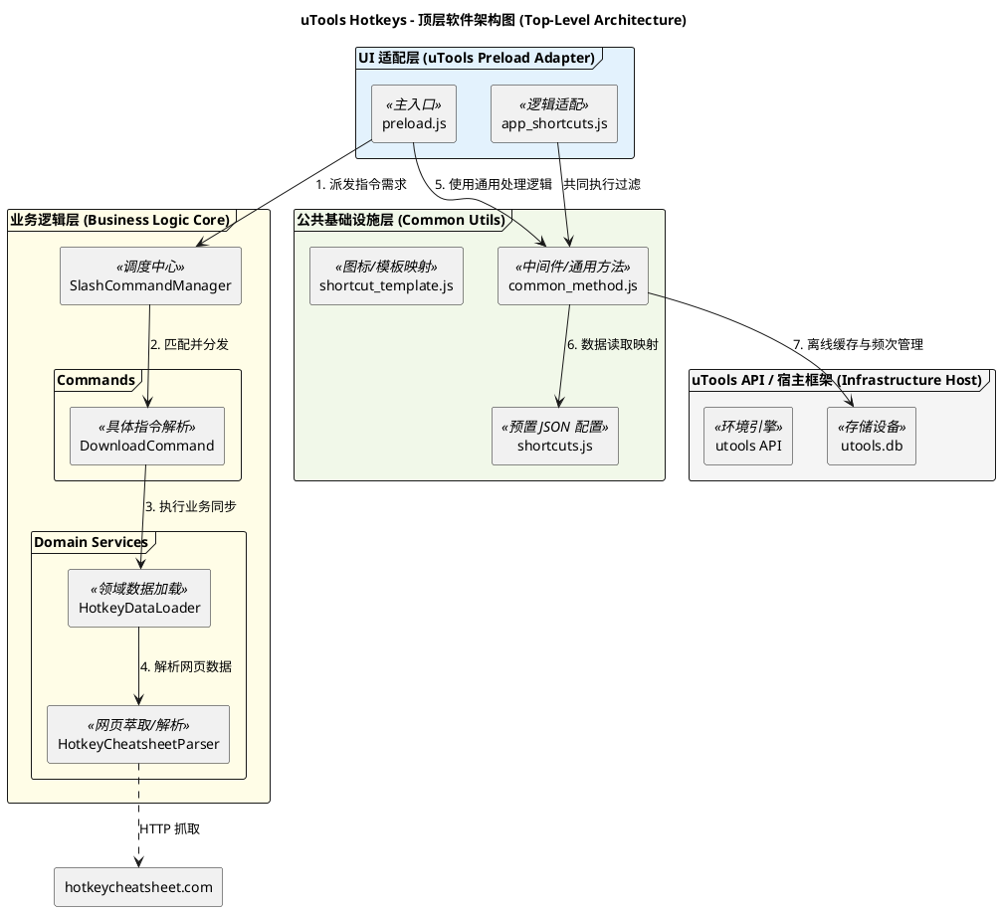
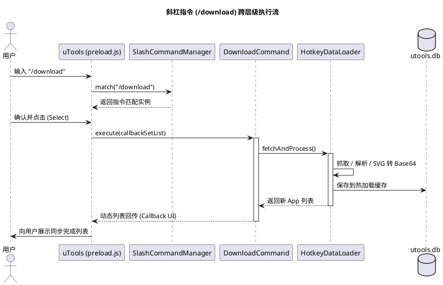

# 软件系统架构设计文档 (Software Architecture Design)

## 1. 核心架构设计理念

本项目采用了“外壳与内核”相隔离的架构模式。

- **uTools 宿主外壳 (Host Shell)**：由 uTools API、`preload.js`、`common_method.js` 等构成，负责与原生桌面系统环境集成。
- **业务逻辑内核 (Business Logic Core)**：由 `SlashCommandManager` 驱动，包含命令逻辑和领域模型，尽可能与宿主环境解耦以保持逻辑纯净。

## 2. 软件顶层架构 (Top-Level Component Diagram)

该图展示了框架、UI、业务核心及基础设施层之间的依赖边界。

## 3. 分层职责矩阵 (Layer Responsibility Matrix)

| 层级 (Layer) | 关键组件 (Key Components) | 职责 (Responsibility) | 边界定义 |
| :--- | :--- | :--- | :--- |
| **uTools 宿主环境层** | `utools.*` API, `utools.db` | 提供文件系统、多语言环境、本地数据库存储等能力。 | 宿主系统原生接口。 |
| **UI 适配层** | `preload.js`, `app_shortcuts.js` | 响应 uTools 的回调（`enter`, `search`, `select`），桥接业务逻辑。 | 处理所有 `utools` 直接调用的生命周期。 |
| **业务逻辑层 (内层)** | `SlashCommandManager`, `DownloadCommand`, `HotkeyService` | 管理斜杠指令的解析与分发。执行抓取、SVG 转换、领域模型更新。 | **DIP 核心层**，独立于具体 UI，通过回调向外通信。 |
| **基础设施层 (底层)** | `common_method.js`, `shortcuts.js`, `template.js` | 提供工具函数、本地静态快捷键配置模板、UI 图标映射等复用能力。 | 同时服务于 Preload 层与业务层。 |

## 4. 业务执行流 (Sequence Diagram)

## 5. 设计隔离优势 (Isolation Design Benefits)

1. **框架/业务分离**：`preload.js` 只负责监听 uTools 消息。一旦匹配到 `/` 开头的指令，其控制权即移交给 `SlashCommandManager`，有效防止主入口文件逻辑爆炸。
2. **逻辑可移植性**：核心指令逻辑（如抓取和 Parser）理论上可以在 Node.js 或其他外框环境下运行，因为它依赖的是传进来的 `callbackSetList` 抽象。
3. **数据冗余管理**：通过 `common_method.js` 将静态 `shortcuts.js` 与动态拉取的 `utools.db` 缓存统一管理，确保基础功能离线可用，扩展功能实时同步。
