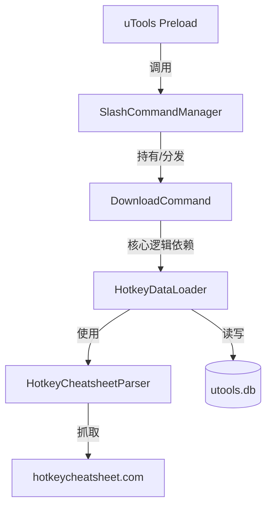
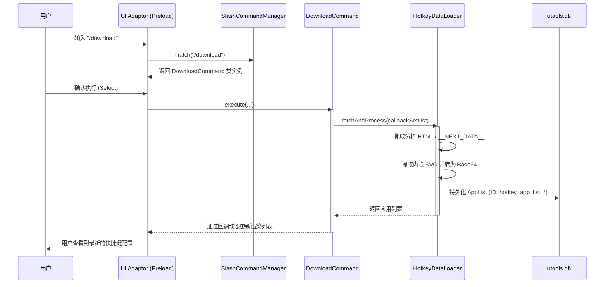

# 软件系统架构设计文档 (Software Architecture Design)

## 1. 核心设计原则

本项目旨在为 uTools 快捷键搜索插件提供一个可扩展、易维护的底层架构。目前遵循以下核心原则：

- **DIP (Dependency Inversion Principle - 依赖倒置原则)**：UI 层 (`preload.js`) 不直接依赖于具体的业务命令逻辑。相反，它通过 `SlashCommandManager` (抽象接口) 进行指令的注册与分发。
- **DDD (Domain-Driven Design - 领域驱动设计)**：将项目的核心逻辑拆分为独立领域（如 Hotkey Cheatsheet 数据解析、持久化服务），并通过 `Service` 层的封装保持领域逻辑的纯净。
- **关注点分离 (Separation of Concerns)**：确保 UI 解析、指令匹配、数据抓取和数据存储各司其职。

## 2. 软件分层架构 (Layered Architecture)

| 层级 | 职责说明 | 对应模块/文件 |
| :--- | :--- | :--- |
| **UI 适配层 (uTools API)** | 处理 uTools 提供的 `enter`, `search`, `select` 回调，负责与用户界面的交互。 | `preload.js`, `app_shortcuts.js` |
| **指令分发层 (Command Layer)** | 管理所有斜杠指令 (Slash Commands)，负责路由分发与指令匹配。实现 UI 与逻辑解耦。 | `slash_command_manager.js`, `DownloadCommand` |
| **领域/应用服务层 (Service Layer)** | 核心业务单元。负责 HTML 解析、SVG 提取、跨域数据加载及持久化逻辑封装。 | `hotkey_service.js` (Parser, DataLoader) |
| **基础设施层 (Infrastructure)** | 提供底层支持，如 `utools.db` 持久化接口、全局配置及公共工具方法。 | `common_method.js`, `utools.db`, `shortcuts.js` |

## 3. 组件依赖关系 (Component Relationship)

## 4. 指令执行流程 (Command Execution Flow)

当用户在搜索框中输入斜杠指令（如 `/download`）并确认执行时，系统按以下流程运行：

## 5. 架构优势与隔离设计

1. **指令热插拔**：通过 `slashCommandManager.register()` 注册模式，新增功能只需实现 Command 接口并注册，无需改动 `preload.js` 主逻辑。
2. **数据离线可读**：图标以 Base64 形式存入 `utools.db`，确保在断网或 API 失效时，插件首页仍能渲染已同步的应用图标。
3. **环境无关性**：`HotkeyCheatsheetParser` 独立于 uTools API，依赖于标准 DOM 操作，可轻松进行单元测试。

## 6. 相关技术文档
- [SVG 图标抓取与转换方案](svg-icon-extraction-scheme.md)
- [支持下载应用列表规范](../spec/spec-00001-support-download-applist.md)
- [支持下载应用快捷键规范](../spec/spec-00002-support-download-app-hotkeys.md)
