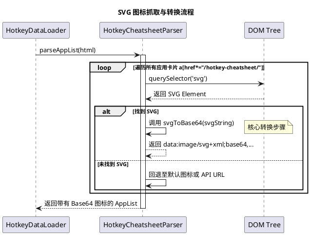

# 技术设计：SVG 图标抓取与转换方案

## 1. 背景与动机
在早期的 `/download` 命令实现中，我们通过拼接 URL（如 `.../api/v1/apps/${id}/icon`）来获取应用图标。然而，由于 `hotkeycheatsheet.com` 的架构更新：
- **原始接口失效**：许多应用的图标直接访问会返回 `404` 错误。
- **内联化趋势**：网站现在将图标以 `<svg>` 标签的形式直接嵌入在 HTML 页面中，不再通过独立的图片文件分发。

为了应对这些变化，本项目引入了直接从 HTML 源码中提取 SVG 并转换为 Base64 数据流的方案。

## 2. 核心技术架构

### 2.1 提取流程 (Extraction Flow)
抓取器不再请求图片 URL，而是在解析页面 DOM 时直接捕获元素内容。



### 2.2 转换算法 (Conversion Logic)
由于 `btoa()` 原生不支持 Unicode 字符，SVG 图标在转换前必须进行编码处理，以确保在所有环境下（尤其是 Windows）图标渲染正常。

**核心方法实现：**
```javascript
svgToBase64(svgString) {
  try {
    // 补全 xmlns 命名空间，确保作为 Data URL 渲染时无误
    if (!svgString.includes('xmlns="http://www.w3.org/2000/svg"')) {
      svgString = svgString.replace('<svg', '<svg xmlns="http://www.w3.org/2000/svg"');
    }
    
    // 兼容 Unicode 处理的 Base64 转换
    const base64 = btoa(unescape(encodeURIComponent(svgString)));
    return `data:image/svg+xml;base64,${base64}`;
  } catch (e) {
    console.error('SVG 转换失败:', e);
    return null;
  }
}
```

## 3. 方案优势
1. **零额外请求**：图标随列表 HTML 一次性下载，显著减少了 HTTP 请求次数，加快了 `/download` 列表的展现速度。
2. **无限缩放**：SVG 是矢量格式，在 uTools 各种 DPI 的屏幕下都能保持极高的清晰度。
3. **离线高可用**：图标以 Base64 形式持久化在 `utools.db` 中，即使在断网环境下，已下载的应用列表依然能完美显示图标。
4. **强适配性**：通过 `a[href*="/hotkey-cheatsheet/"]` 选择器，可以同时兼容首页、`/zh/` 专题页以及操作系统（`/os/windows`）等多种抓取路径。

## 4. 外部网站实现约束 (Website Implementation Constraints)

本方案的有效性高度依赖于 `hotkeycheatsheet.com` 当前的 DOM 结构。若以下约束发生变化，下载与抓取功能可能需要适配：

1.  **卡片定位约束**：目前通过 `a[href*="/hotkey-cheatsheet/"]` 定位应用卡片。若网站修改了 URL 路由规则（例如移除该路径段），抓取器将无法识别有效的应用项。
2.  **图标嵌入约束**：
    -   当前假设 `<svg>` 标签作为卡片的子元素存在于 HTML 源码中。
    -   若未来网站改为通过 `background-image` 加载、使用 `canvas` 渲染或切换回独立的图片加载流，当前的 `svgToBase64` 逻辑将失效。
3.  **信息层级约束**：
    -   **名称**：预期在卡片内通过 `h3, h2, p, strong` 等标签获取。
    -   **描述**：预期在卡片内的最后一个 `p` 标签中获取。
    -   若网站使用了混淆的类名（Obfuscated Classes）或复杂的嵌套结构，信息提取的准确性可能下降。
4.  **多语言路径约束**：脚本通过 `getLang()` 动态构建类似 `/zh/os/windows` 的路径。若网站改变了语言路由前缀（例如将 `/zh/` 移至子域名），初始请求将失败。
5.  **渲染模式约束**：目前代码运行在插件的 `preload` 环境中，依赖于初始 HTML 返回的完整 DOM。若网站改为全异步渲染且不提供 `__NEXT_DATA__` JSON，则需要引入无头浏览器环境（如 `browser_subagent` 所模拟的环境）进行解析。

## 5. 后续演进
- **占位符机制**：对于部分确实不提供任何图标（SVG/IMG）的应用，考虑生成基于应用首字母的圆形图标作为占位。
- **清理逻辑**：在转换过程中，可移除 SVG 中的冗余元数据（如 `t="..."`, `p-id="..."`）以进一步缩小持久化数据的体积。
