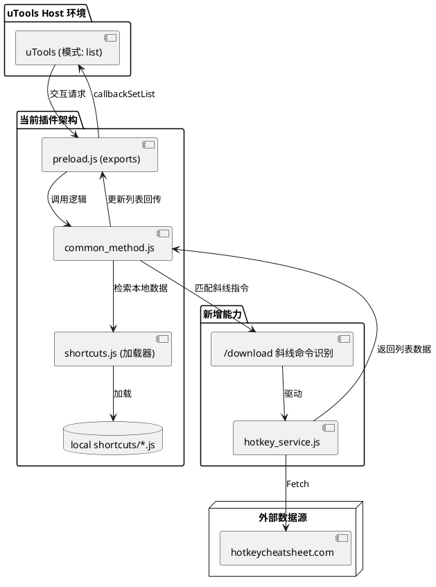
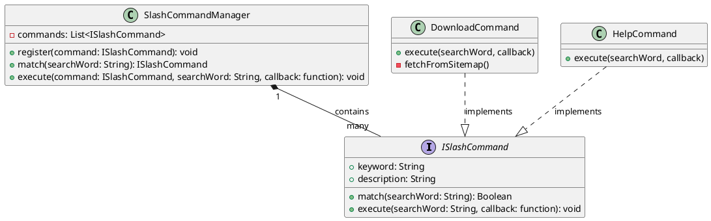
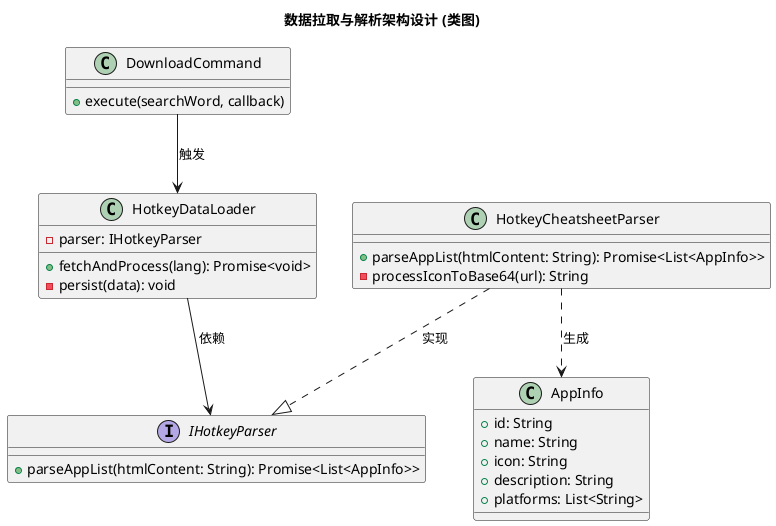
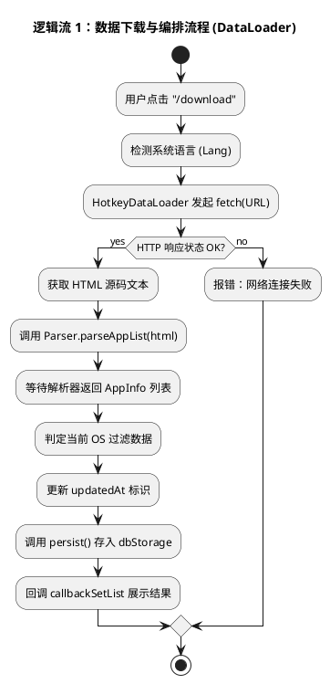
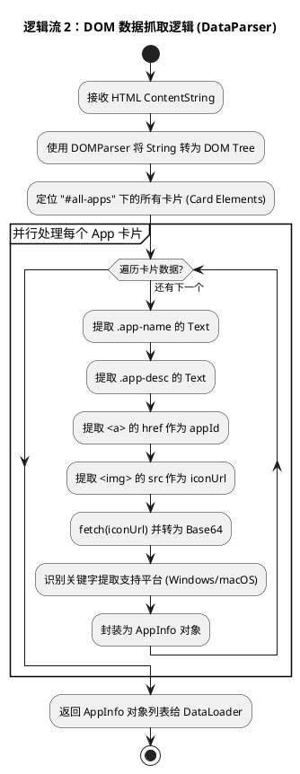

# 需求设计：支持从 hotkeycheatsheet.com 下载快捷键配置 (spec-00001)

## 1. 目标
通过在 uTools 中输入斜线命令 `/download`，用户可以浏览并下载 `https://hotkeycheatsheet.com/` 上的快捷键配置，下载后可以直接在插件中搜索使用。

## 2. 用户流程
1. **启动命令**: 用户在搜索框输入 `/download`。
2. **选择命令**: 列表显示 “下载快捷键配置”，回车确认。
3. **获取列表**: 插件从 `https://hotkeycheatsheet.com/sitemap.xml` 或首页获取支持的所有应用列表。
4. **过滤平台**: 根据用户当前操作系统（macOS/Windows），过滤出支持对应平台的应用。
5. **展示列表**: 插件按操作系统（macOS/Windows）展示当前支持的所有应用列表，供用户浏览参考。
(注：本次需求暂不实现下载、解析和保存功能。)


## 3. 详细设计

### 3.1 斜线命令实现



在 `common_method.js` 的 `search` 逻辑中增加对 `/` 开头词条的处理。为了保证后续易于扩展（如下表所示），建议采用**命令分发模式 (Command Dispatcher)**：



### 3.1.1 核心组件说明
- **ISlashCommand (接口)**：定义了所有斜线命令的基准。包含 `keyword` (如 `/download`)，`description` 以及核心逻辑 `execute`。
- **SlashCommandManager (管理器)**：维护命令注册表。当 `common_method.js` 收到以 `/` 开头的输入时，由管理器寻找最匹配的命令。
- **可扩展性**：未来若需增加 `/clear`, `/export` 等功能，仅需新建一个遵循 `ISlashCommand` 的类/对象并注册至管理器，无需修改 `common_method.js` 的核心逻辑。

### 3.1.2 逻辑伪代码
```javascript
// common_method.js
search = (searchWord, shortcuts, callback) => {
    if (searchWord.startsWith('/')) {
        const cmd = slashCommandManager.match(searchWord);
        if (cmd) {
            return cmd.execute(searchWord, callback);
        }
    }
    // ... 原有搜索逻辑 ...
}
```


- 如果 `searchWord` 为 `/download`，或者包含该关键字，优先显示下载命令项。
- 下载命令项的 `description` 显示 “下载快捷键配置。上次同步：[上次拉取时间]”。
- 下载命令项的 `action` 设置为 `download_flow`。


### 3.2 数据获取与解析
- **语言检测**: 使用 `utools.getNativeId()` 或相关 API 检测系统语言，并映射至网站支持的语言代码（如 `zh`）。
### 3.2.1 软件架构设计 (分层解耦)
为了保证抓取逻辑与业务流程解耦，系统将职责划分为 **DataLoader (业务编排)** 与 **DataParser (数据解析)**。



### 3.2.2 逻辑流 1：下载与整体编排
描述斜线命令发起后，系统如何协调网络、解析与存储。



### 3.2.3 逻辑流 2：DOM 解析与数据转换
描述解析器内部如何从 HTML 结构中提取出所需的应用信息。



- **展示方式**:
    - 在 uTools 列表中展示应用名称及其对应的 ID。
    - (注：解析与下载逻辑暂缓开发)


### 3.3 存储方案
- **存储位置**: 使用 `utools.dbStorage` 持久化应用列表数据，键名为 `hotkey_app_list`。
- **数据结构**: 存储的对象应包含应用的基础信息，以便在后续搜索中直接展示：
    ```javascript
    {
      _id: 'hotkey_app_list',
      data: [
        {
          id: 'vscode',          // 应用唯一标识
          name: 'Visual Studio Code', // 应用名称
          icon: 'data:image/png;base64,...', // 图标拉取后转换为 Base64 存储为本地数据，确保离线可用性能更好 

          description: 'The most popular code editor', // 简短描述
          platforms: ['macos', 'windows'] // 支持的平台
        },
        // ... 更多应用
      ],
      updatedAt: 1711000000000 // 更新时间戳，用于判断是否过期
    }
    ```
- **同步策略**: 
    - **按需拉取**: 仅在用户显式启动 `/download` 指令并触发更新时才进行网络抓取。
    - **状态展示**: 在 `/download` 命令的 `description` 中实时展示上次成功同步的时间（如：“下载快捷键配置。上次同步：2024-03-21”）。

### 3.4 UI/UX 细节
- **多语言支持**: 
    - **系统语言自动适配**: 插件内的所有显示文字（如“下载快捷键配置”、“上次同步”等）必须根据 uTools 的系统语言自动切换（如中文显示为中文，其他默认英文）。
    - **数据拉取适配**: 在向网站发起请求时，检测并将语言代码注入 URL（例如：若是中文系统，优先请求 `https://hotkeycheatsheet.com/zh/hotkey-cheatsheet/...`）。
- **Loading 状态**: 在获取列表和下载详情时，使用 `callbackSetList` 显示 “正在加载中...” 的占位符。
- **错误处理**: 如果网络请求失败，提示用户检查网络或代理设置。


## 5. 测试设计

### 5.1 斜线命令匹配测试
- **输入匹配**: 验证输入 `/`, `/down`, `/download` 是否能准确触发对应的“下载”命令项显示。
- **权重测试**: 验证当输入 `/download` 时，该命令项是否处于列表第一顺位。

### 5.2 网络与抓取测试
- **网络异常**: 断开网络连接，触发 `/download`，验证是否显示预定义的错误提示（如“网络请求失败，请检查设置”）。
- **超时处理**: 模拟网络极慢的情况，验证 “正在加载中...” 占位符是否能正确显示且不导致插件卡死。
- **多语言抓取**: 在中文系统下，验证是否向包含 `/zh/` 的 URL 发起请求；在非中文系统下，验证是否请求英文原版 URL。

### 5.3 数据持久化测试
- **存储验证**: 成功拉取列表后，使用 uTools 开发者工具检查 `dbStorage` 中是否存在 `hotkey_app_list_${lang}` 键值且内容包含 icon (Base64), name, description。
- **冷启动**: 重启 uTools 或插件，进入 `/download`，验证是否能秒级显示缓存的列表。
- **时间戳显示**: 验证命令项描述中的 “上次同步：XXXX-XX-XX” 是否与 `dbStorage` 中的 `updatedAt` 映射一致。

### 5.4 交互与边界测试
- **搜索定位**: 在拉取后的应用列表中，验证是否可以通过输入应用名称（如 "vscode"）进行二次过滤搜索。
- **平滑切换**: 验证从 “搜索命令” 到 “拉取显示列表” 的过程中，UI 是否有明显的跳动或不协调。
