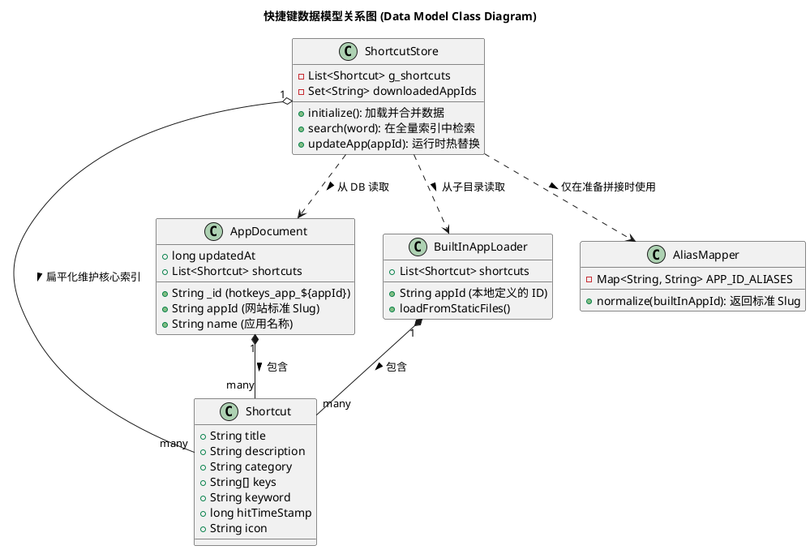
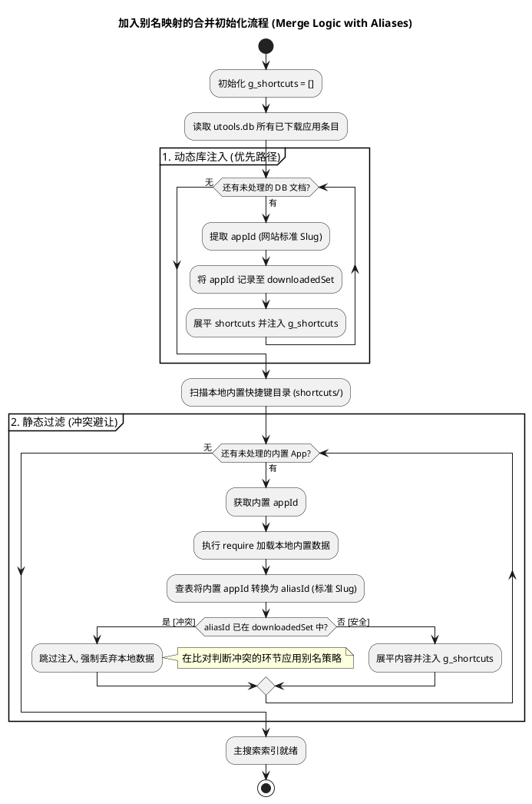

# 需求设计：下载并持久化特定应用的快捷键 (spec-00002)

## 1. 目标
支持在 `/download` 下载命令的应用列表中，当用户选择某个应用时，自动抓取该应用在 `hotkeycheatsheet.com` 上的所有快捷键配置，并持久化到本地。下载完成后，这些快捷键应立即进入插件的可搜索范围，而无需再次通过网络获取。

## 2. 用户流程
1. **启动命令**: 用户输入 `/download` 并进入应用列表。
2. **选择应用**: 用户点击列表中的某个应用（如 "Visual Studio Code"）。
3. **静默下载**: 插件展示加载状态（如通知），在后台访问该应用的详情页并抓取数据。
4. **持久化**: 下载成功后，将数据以应用为单位存入 `uTools DB`。
5. **即刻可用**: 插件更新当前内存中的快捷键列表，用户可以立即搜索到该应用的快捷键。

## 3. 技术方案设计

### 3.1 数据模型关系图 (Data Model Class Diagram)

下表展示了系统中核心数据类（内存对象与持久化文档）之间的结构与关系：



### 3.2 触发与分发 (Selection Trigger)

在 `hotkey_service.js` 的 `DownloadCommand` 返回的列表项中增加核心标识：
- `action`: `'download_app_hotkeys'`
- `id`: 应用的 Slug (来自网站 URL，如 `vscode`)
- `name`: 应用的名称，用于展示加载进度。

在 `preload.js` 中捕获此 `action` 并调用 `HotkeyDataLoader.fetchAndProcessAppHotkeys(id)`。

### 3.3 详情页抓取与转换 (Data Extraction & Transformation)

针对应用详情页的抓取与数据转换策略，核心目标是将网页端数据完美转化为本项目的 `Shortcut` 实体对象序列。

1. **页面拉取与数据提取 (Fetch & Extract)**:
   - **请求构建**: 结合当前系统语言设定（判断是否包含 `zh`），按需组装带前缀的目标详情页 URL（例如 `https://hotkeycheatsheet.com/zh/hotkey-cheatsheet/vscode`）。
   - **无头拉取**: 在后台直接发送 `fetch()` 请求提取该详情页的 HTML 文本。
   - **内部数据脱壳**: 目标网页由 Next.js 构建，借由 `DOMParser` 直接锁定 `<script id="__NEXT_DATA__">` 节点并抽取 `textContent`。使用 `JSON.parse` 将网页在服务侧的初始渲染状态转换成结构化的 JS 对象树。

2. **数据层级映射与还原 (Schema Resolution)**:
   - 定位应用详情：在 JSON 树的深入层级（如 `props.pageProps.app`）中提取核心数据。
   - 分类关联（Join）：网页 JSON 数据通常将分类存储在 `categories` 列表中，而具体快捷键通过 `categoryId` 进行弱关联。需通过查表将每一个快捷键的 `categoryId` 还原为人类可读的 `category` 名称文本。

3. **双平台与键位转换 (Platform & Keys Parsing)**:
   - **操作平台过滤**: 调用 `utools.isMacOs()` 判定当前执行环境。若为 macOS，则严格只读取原对象中的 `macShortcut` 数组；否则读取 `windowsShortcut`。对判定环境下无绑定的条目执行丢弃。
   - **符号标准化 (Symbol Mapping)**: 网页数据的数组中可能包含原始文本（如 `Cmd`）或特殊 Unicode 符号，需经由正则表达式统一转换为本项目可模拟触发的小写标准键位。
     - Mac 映射示例：`⌘`、`cmd` -> `command`；`⌥`、`alt` -> `option`；`⇧` -> `shift`；`⌃`、`ctrl` -> `ctrl`。
   - 最终将每个按键规范化为 `['command', 'shift', 'p']` 等严格格式。

4. **实体装配与关键词注入 (Entity Assembly)**:
   - 将上述整理好的字段（`title`, `description`, `category`, `keys` 等）装配成本项目核心的 `Shortcut` 结构体。
   - **多维 Keyword 预生成**: 为了适应我们底层的无大小写模糊 `indexOf` 搜索规则，需在对象组装阶段将应用的基础信息（`appName`, `appId`）、内容信息（`title`, `description`）和分类信息（`category`）无缝拼接成一段超长 `keyword` 字符串。
   - *示例*: “复制当前行”的 keyword 可能被包装为：`"vscode visual studio code 基本编辑 复制当前行 copy current line"`。

### 3.4 本地存储方案 (Persistence)

1. **数据库**: 使用 `utools.db` 以支持大规模数据持久化（相比 `dbStorage` 更适合结构化查询）。
2. **Key 命名**: `hotkeys_app_${appId}`。
3. **数据结构 (Document Schema)**:
   ```javascript
   {
     _id: 'hotkeys_app_vscode',
     appId: 'vscode',
     name: 'Visual Studio Code',
     shortcuts: [
       {
         title: "Command Palette",
         description: "Show all commands",
         keys: ["ctrl", "shift", "p"],
         keyword: "vscode command palette display",
         category: "General"
       },
       // ...更多
     ],
     updatedAt: 1711000000000
   }
   ```

### 3.5 动态合并与搜索 (Runtime Integration)

修改 `shortcuts.js` 的初始加载逻辑与搜索流程，支持动态数据的无缝接入：

1.  **分层数据索引 (Layered Indexing)**:
    - **静态库 (Static)**: 系统启动时，继续通过 `requireAll()` 扫描内置 `shortcuts/` 目录。
    - **动态库 (Dynamic)**: 同时通过 `utools.db.allDocs('hotkeys_app_')` 读取本地数据库中所有已下载的应用快捷键。
    - **内存主索引 (`g_shortcuts`)**: 将上述两部分数据经去重、映射后整合为内存主数组。

2.  **别名映射与标准化 (Mapping & Normalization)**:
    - **问题背景**: 内置 ID (如 `jet_brains`) 与网站 Slug (如 `intellij-idea`) 可能存在命名差异。如果不处理，即使下载了同款软件，也会因为 ID 不匹配而出现重复搜索结果。
    - **别名映射表 (`APP_ID_ALIASES`)**: 在 `shortcuts.js` 中维护一个核心映射字典，将内置 ID 映射为网站标准 Slug。
    - **规范化判定**: 在合并流程中，内置 App 的 `appId` 会先通过映射表寻找其对应的“标准 Slug”。比对去重时，以映射后的标准 ID 为准。

#### 初始化流程 (Initialization Flow)



3.  **冲突覆盖处理 (Conflict & Override Logic)**:
    - **延迟别名验证**: 为了最小化对现有代码逻辑的干预，`APP_ID_ALIASES` 不参与早期文件扫描阶段，而是**仅在内置数据准备注入 `g_shortcuts` 数组时进行比对**。若转换后的 `aliasId` 在 `downloadedSet` 中命中，则丢弃该组内置数据。
    - **单一源原则**: 确保全局 `g_shortcuts` 数组中同一应用的快捷键仅保留一份。

4.  **多关键字搜索增强 (Search Capability)**:
    - **全字段检索**: 搜索词将匹配 `appName`、`title`、`description` 和 `category`。
    - **排序逻辑**: 所有的搜索结果均根据 `hitTimeStamp` (点击次数/时间) 进行降序排列，实现“越用越准”。

5.  **运行时热更新 (Hot Update)**:
    - **基于事件的内聚更新**: 当 `hotkey_service.js` 中的 `/download` 命令成功抓取新应用数据后，直接调用 `slash_command_manager` (或底层 `common_method.js`) 提供的重新初始化接口。**全程对 `preload.js` 透明**，不在 UI 层增加任何特定的数据更新负担。

## 4. 性能优化设计 (Performance Optimization)

### 4.1 静态架构优化 (Architectural/Static Design)
从软件架构结构层面进行的性能布局调整：
- **存储与检索解耦**: 采用“DB 持久化，内存检索”的架构。数据库 (`utools.db`) 仅作为冷数据仓库；热数据全量加载至 JS 内存堆中。在搜索的核心循环内，不允许发生任何磁盘 IO 或异步异步操作，从而实现极速反馈。
- **扁平化搜索池**: 所有的 App 快捷键不再以树状或分散对象形式存储，而是在初始化时统一展平为单层数组 `g_shortcuts`。这使得检索过程简化为单一的线性扫描，最大化了 V8 引擎在执行 `Array.filter` 时的性能表现。
- **关键词预索引策略**: 采用“空间换时间”的策略。在数据加载或下载阶段，提前将 `title`, `appName`, `category`, `description` 拼接生成 `keyword` 主键。这种预计算机制免去了在搜索时动态格式化文字的开销。

### 4.2 动态操作优化 (Operational/Dynamic Design)
描述如何分步完成性能优化的具体运行时操作逻辑：
- **启动阶段：四步索引预建**:
    1. **查询扫描**：并发调用 `allDocs()` 读取数据库，收集已下载条目的集合。
    2. **完全加载**：利用 `require` 安全加载所有内置数据。
    3. **冲突过滤**：通过 `downloadedSet` 结合 `APP_ID_ALIASES` 执行 `O(1)` 的冲突屏蔽判定。
    4. **合并冻结**：完成 `g_shortcuts` 的填充，并冻结初始索引。
- **执行阶段：增量切片热更新**:
    1. **触发更新**：在 `/download` 后，通过底层的命令管理器重新拉取索引更新。
    2. **切离与注入**：利用 `Array.filter` 派生出不含旧版数据的数组，再 `push` 新数据。此步操作不会破坏原数组引用链条，最大程度减少重渲开销。
- **检索阶段：关键词分词匹配逻辑**:
    1. **Query 分词**：将用户输入的搜索词按空格预拆分。
    2. **主键过滤**：在过滤器中直接对预计算的 `keyword` 执行 `indexOf` 匹配。
    3. **权重重整**：利用 `hitTimeStamp` 实时重新排列数组顺序。
## 5. 现有代码变动清单 (Code Change List)

要实现上述数据合并与搜索方案，尽可能遵循“最小修改”原则，主要依赖底层命令系统重构：

| 模块 / 文件 | 变更位置 | 职责说明 |
| :--- | :--- | :--- |
| **`shortcuts.js`** | **静态循环注水后** | 1. 顶部新增 `APP_ID_ALIASES`。<br>2. 调整加载逻辑：先加载完静态对象，然后在即将 `push` 到主数组前，进行 `downloadedSet.has(aliasId)` 比对，拦截重复数据。 |
| **`common_method.js`** / **底层命令逻辑** | **`enter()` 工具函数** | 升级当前的同步静态加载逻辑为“全量合并模式”，处理 DB 数据的读取与展平。 |
| **`hotkey_service.js`** | **下载回调层 (`execute`)** | 1. 编写基于 `__NEXT_DATA__` 解析快捷键详情页的核心逻辑并存入 DB。<br>2. 下载成功后，通过底层钩子或命令流重新调度一次 `enter()` 处理（避开 `preload.js`）。 |
| **`slash_command_manager.js`** | **初始化与回调** | 作为指令中心，提供供外部 (如 `hotkey_service.js`) 使用的无感初始化与重新加载数据管道。 |
---

## 6. UI/UX 细节
- **Loading 反馈**: 调用 `utools.showNotification('正在获取 [App] 的快捷键数据...')`。
- **状态提示**: 列表中的应用若已下载，可以在图标右下角添加小勾选标识，或者在 description 中标注“本地已收录”。
- **单项搜索**: 搜索结果应包含“应用分类”，例如：`[VS Code] 基本编辑 - 复制整行`。

## 7. 测试要点
- **断网测试**: 在离线环境下，验证已下载的应用快捷键是否依然能正常搜索和触发模拟按键。
- **多平台同步**: 同一套代码在 Mac 和 Windows 下下载的快捷键应分别为其对应的平台按键。
- **ID 冲突**: 验证不同语言（zh/en）下同一个应用 ID 的存储处理，确保不会相互覆盖导致数据混乱。
