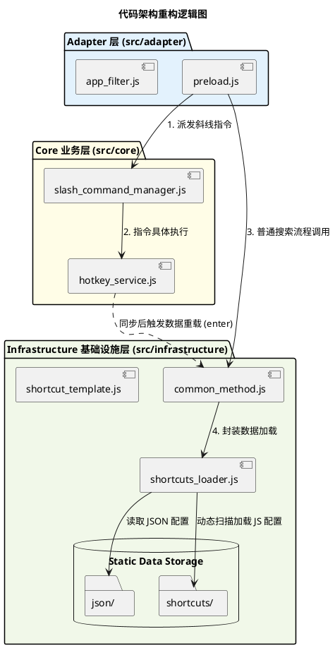

# 技术规格书 (Technical Specification) - spec-0003-refactor-for-architecture

本文档详细说明了将项目代码从根目录迁移至 `src/` 目录并根据架构设计规范进行模块化拆分的具体实现方案。

## 1. 目标 (Goal)
- **解耦主文件**: 将 `preload.js` 从一个包含业务逻辑的巨型脚本转变为轻量的适配层。
- **物理架构优化**: 遵循 `architecture.md` 中定义的 Adapter、Core、Infrastructure 分层结构。
- **提升可维护性**: 通过清晰的目录分级（`src/adapter`, `src/core`, `src/infrastructure`），使得新功能的添加更具预测性。

## 2. 用户流程 (User Workflow)
重构为代码结构层面的变动，用户侧交互体验（搜索、`/download` 指令、自动过滤当前应用）应保持完全一致。

## 3. 详细设计 (Detailed Design)

### 3.1 架构图 (PlantUML)

### 3.2 目录映射说明 (Directory Mapping)

| 旧文件/目录 | 新路径 | 职责 (Role) |
| :--- | :--- | :--- |
| `preload.js` | `src/adapter/preload.js` | uTools 生命周期入口，消息中配器。 |
| `app_shortcuts.js` | `src/adapter/app_filter.js` | **重命名**，隔离具体的应用过滤逻辑。 |
| `slash_command_manager.js` | `src/core/slash_command_manager.js` | 领域无关的指令注册与分发容器。 |
| `hotkey_service.js` | `src/core/hotkey_service.js` | 包含数据拉取 (Loader) 与解析 (Parser) 的业务核心。 |
| `common_method.js` | `src/infrastructure/common_method.js` | 核心交互逻辑（enter/search/select）。 |
| `shortcuts.js` | `src/infrastructure/shortcuts_loader.js` | **重命名**，实现从多源加载快捷键的底层逻辑。 |
| `shortcut_template.js` | `src/infrastructure/shortcut_template.js` | 共享的静态模板映射与图标常量。 |
| `json/` | `src/infrastructure/data/json/` | 基础静态 JSON 配置。 |
| `shortcuts/` | `src/infrastructure/data/shortcuts/` | 插件预置的应用快捷键 JS 脚本。 |

### 3.3 路径迁移细节

- **plugin.json**: 修改 `"preload": "src/adapter/preload.js"`。
- **require() 路径**: 
  - `preload.js` 将使用 `require('../infrastructure/common_method.js')`。
  - `common_method.js` 将使用 `require('../core/slash_command_manager.js')`。
  - `shortcuts_loader.js` (原 `shortcuts.js`) 需更新 `requireAll()` 中的绝对路径扫描。

## 4. 测试设计 (Test Design)

| 测试场景 | 验证点 | 预期结果 |
| :--- | :--- | :--- |
| 插件启动 (enter) | 正常加载数据，搜索框出现排序后的列表。 | 无报错，列表显示正确。 |
| 关键词搜索 | 输入 "copy" 等搜索，列表准确过滤。 | 搜索逻辑正常运行。 |
| 斜杠指令 | 输入 `/download`。 | 触发应用列表获取，UI 显示 Loading 动画。 |
| 应用关联筛选 | 通过 uTools 功能“搜索应用快捷键”进入。 | 仅展示当前前台应用的快捷键。 |

## 5. 任务拆分 (Task List)

- [ ] **准备阶段**:
  - [ ] 创建 `src/adapter`, `src/core`, `src/infrastructure/data` 目录。
- [ ] **Adapter 层迁移**:
  - [ ] 移动 `preload.js` 并修正 `common_method`, `hotkey_service` 的引用。
  - [ ] 移动并更名 `app_shortcuts.js` -> `src/adapter/app_filter.js`。
- [ ] **Core 层迁移**:
  - [ ] 移动 `slash_command_manager.js` 至 `src/core/`。
  - [ ] 移动 `hotkey_service.js` 至 `src/core/` 并修正其内对 `common_method` 的引用。
- [ ] **Infrastructure 层迁移**:
  - [ ] 移动 `common_method.js` 并修正对 `slash_command_manager` 和 `shortcuts_loader` 的引用。
  - [ ] 移动并更名 `shortcuts.js` -> `src/infrastructure/shortcuts_loader.js`。
  - [ ] 移动 `shortcut_template.js`。
  - [ ] 移动 `json/` 和 `shortcuts/` 目录至 `src/infrastructure/data/`。
- [ ] **全局同步**:
  - [ ] **同步修改 `plugin.json` 中的 `preload` 路径**。
  - [ ] 逐文件检查 `__dirname` 关联的动态路径（特别是 `shortcuts_loader.js`）。
- [ ] **功能闭环验证**:
  - [ ] 验证 `/download` 指令是否正常工作。
  - [ ] 验证数据持久化 (dbStorage) 是否仍然有效。