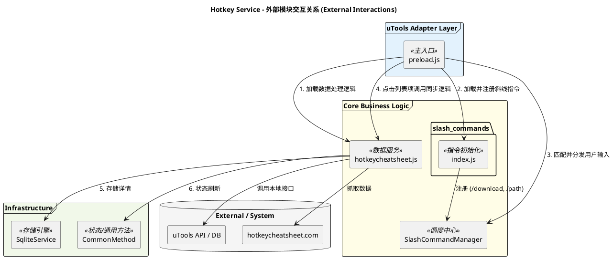
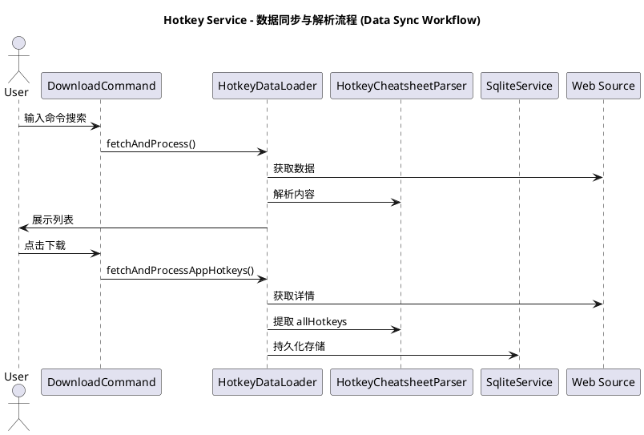

# Hotkey Cheatsheet Service 软件设计文档

## 1. 模块上下文与外部接口 (Module Context & External Interfaces)

`hotkeycheatsheet` 是负责从外部源同步快捷键数据，并将其持久化到本地的数据服务层。与之配合的斜线命令已解耦至独立目录。

### 1.1 外部依赖 (External Contacts)
*   **hotkeycheatsheet.com**: 数据来源。服务通过 HTTP 抓取该站点的 HTML 和 RSC (React Server Components) 流。
*   **uTools API**:
    *   `utools.db`: 用于存储轻量级的应用列表信息和同步元数据。
    *   `utools.dbStorage`: 用于存储用户配置（如 SQLite 路径）。
    *   `utools.showOpenDialog`: 选择本地存储路径。

### 1.2 外部模块交互关系 (External Interaction Diagram)

### 1.3 暴露的指令接口 (Slash Command Interfaces)
*   **`/download`**: 开启应用列表获取流程。抽离至 `src/core/slash_commands/download.js`。
*   **`/path`**: 设置 SQLite 数据库存储路径。抽离至 `src/core/slash_commands/path.js`。

---

## 2. 内部实现架构 (Internal Architecture)

### 2.1 关键组件设计 (Key Components)

| 组件 | 职责 | 实现要点 |
| :--- | :--- | :--- |
| **HotkeyCheatsheetParser** | 网页内容萃取 | 支持 DOM、`__NEXT_DATA__` 及 `__next_f` RSC 流解析。 |
| **HotkeyDataLoader** | 数据生命周期管理 | 处理异步加载、24h 过期检查、图标转码及多平台路由。 |
| **DownloadCommand** | `/download` 交互 | 实现 `SlashCommand` 接口，动态更新应用列表。 |
| **PathCommand** | `/path` 配置管理 | 处理存储初始化、目录管理及核心数据迁移。 |

### 2.2 数据同步与解析流程 (Data Sync Workflow)

### 2.3 存储策略 (Storage Strategy)

为了平衡 uTools 1MB 数据库限制与大量快捷键数据的需求，系统采用了**双层存储架构**：

1.  **Metadata (uTools DB)**: 存储应用列表、同步状态、最近使用记录。确保核心搜索逻辑能快速找到“哪些应用已同步”。
2.  **Bulk Data (SQLite)**: 通过 `sql.js` (WASM) 存储成千上万条具体的快捷键记录。
    *   **Apps 表**: 存储 `id`, `name`, `icon`, `updated_at`。
    *   **Shortcuts 表**: 存储 `title`, `description`, `keys_json`, `keyword`, `category`，并建立 `app_id` 索引及外键级联删除。

### 2.4 按键标准化 (Key Normalization)
解析器会对网页抓取的原始符号进行转换，确保跨平台逻辑一致：
*   `cmd`, `⌘`, `command` → `command`
*   `opt`, `⌥`, `alt` → `option` (Mac) 或 `alt` (Windows)
*   `arrowup`, `up arrow` → `up`
*   ...以及更多符号的统一映射。
