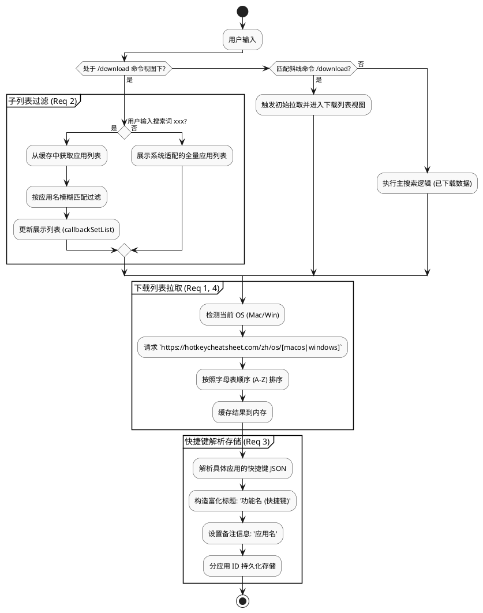
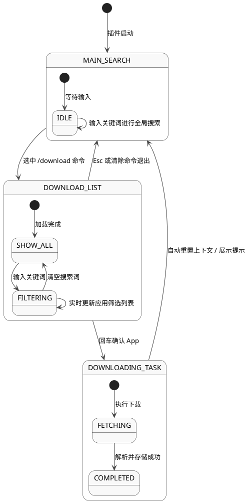

# 快捷键插件下载与展示优化 (Small Fixes)

## 1. 目标
针对现有快捷键插件在下载体验和数据展示上的不足进行优化，具体需求如下：
- **应用列表排序**: 下载的应用列表按字母顺序排列。
- **搜索支持**: 进入 `/download` 列表后，支持输入关键字实时筛选应用。
- **数据富化**: 下载出的快捷键数据，标题中包含快捷键（如 `功能 (Ctrl+S)`），备注中包含应用名。
- **系统过滤**: 根据当前系统请求对应的页面（如 `.../os/windows`），仅展示适配当前系统的应用。

## 2. 用户流程
1. **触发下载**: 用户在 uTools 主输入框中输入 `/download` 或点击相应命令。
2. **展示全量列表**: 插件识别当前 OS，从远程/缓存拉取适配当前系统的应用列表，并按字母序排列展示给用户。
3. **交互式过滤**: 用户直接在输入框继续输入（例如 `vs`），列表根据输入内容实时过滤出 `VS Code` 等应用。
4. **选择下载**: 用户回车选择应用进行下载，界面显示下载进度及完成状态。
5. **高效搜索**: 下载完成后，主搜索界面的快捷键条目以 `功能 (快捷键)` 格式展示，并显示所属应用名，方便识别。

## 3. 详细设计

### 3.1 逻辑架构图

### 3.2 核心逻辑设计

#### 3.2.1 系统适配与全量列表拉取 (Req 1, 4)
- **操作系统检测**: 
    - 使用 `utools.isMacOs()` 判断当前环境。
    - 在 `HotkeyDataLoader` 中增加 `getPlatformUrl()` 方法，根据操作系统返回对应的页面地址：`https://hotkeycheatsheet.com/zh/os/macos` 或 `.../os/windows`。
- **全量列表排序**:
    - 在 `fetchApps()` 成功获取数据后，立即执行客户端排序。
    - 排序逻辑：`apps.sort((a, b) => a.name.toLowerCase().localeCompare(b.name.toLowerCase()))`。
    - 确保用户初次输入 `/download` 时看到的列表即为有序且适配当前系统的。

#### 3.2.2 子视图交互与模糊搜索 (Req 2)
- **状态迁移图 (PlantUML State Diagram)**:

- **状态维持**:
    - 基于上述状态机，插件在 `DOWNLOAD_LIST` 状态下会阻断全局快捷键搜索，确保 `searchWord` 仅作用于 `this.cachedApps`。

#### 3.2.3 快捷键解析与数据富化 (Req 3)
- **数据结构转换**:
    - 在 `HotkeyService.parseAndStore(appId, appName, rawData)` 中执行。
- **标题格式化**:
    - 修改 `formatTitle(action, keys)` 方法：
    - 返回 `${action} (${keys.join(' + ')})`。
- **备注信息设置**:
    - 将 `item.description` 统一设置为 `appName`。
- **持久化**:
    - 存储至 uTools 本地数据库，确保主搜索界面（非命令模式下）搜索时能清晰展示 `功能 (快捷键)` 并知道其属于哪个应用。

**设计原型图 (Mockup)**:

<!DOCTYPE html>
<html lang="zh-CN">
<head>
<meta charset="UTF-8">

</head>
<body>
    

        

            
💻

            

                
保存 (Ctrl + S)

                
Visual Studio Code

            

        

    

</body>
</html>

### 3.3 数据存储与 UI 交互
- **存储**: 继续使用 `utools.dbStorage` 存储。
- **UI**: 
    - 利用 uTools `list` 模式的 `callbackSetList` 实时更新过滤后的列表。
    - 下载过程中的 Loading 状态通过 `callbackSetList` 发送占位条目提示。

## 4. 测试设计
| 功能点 | 测试场景 | 预期结果 |
| :--- | :--- | :--- |
| 应用列表排序 | 打开 `/download` 列表 | 应用名按 A-Z 排序 |
| 系统过滤 (Win) | 在 Windows 机器运行 `/download` | 不应出现 Finder, Transmit 等 Mac 应用 |
| 子搜索过滤 | 在 `/download` 列表界面输入 `ph` | 列表仅显示 Photoshop 相关应用 |
| 数据 enrichment | 搜索已下载的快捷键 | 标题显示为 "保存 (Ctrl + S)"，描述显示应用名 |

## 5. 任务拆分
- [x] 修改 `HotkeyDataLoader` 支持按操作系统拉取列表。
- [x] 增加应用列表字母序排序逻辑。
- [x] 增强 `DownloadCommand` 和 `common_method.js` 支持在进入 `/download` 列表后的关键词过滤逻辑 (State Management)。
- [x] 修改快捷键解析逻辑，丰富数据展示字段 (标题 + 备注)。
- [x] 兼容性测试 (Windows/Mac) 与搜索效果体验。
