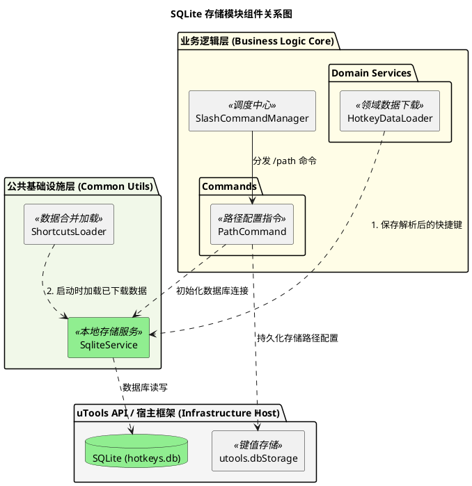
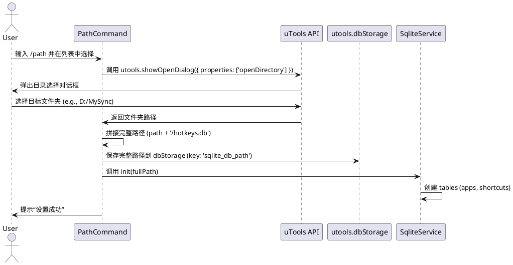
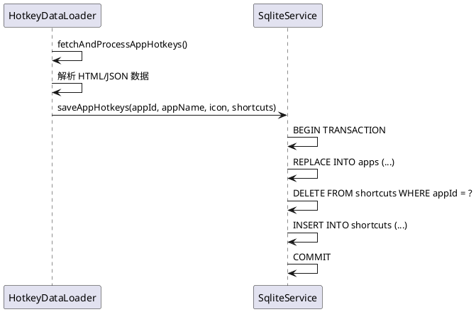

# SQLite 存储方案设计 - spec-00005

## 目标
将下载的快捷键数据从 `utools.db` 迁移到独立的 SQLite 数据库文件中。用户可以通过 `/path` 命令自定义数据库存放路径，从而实现数据持久化、可管理性及跨设备同步（通过同步盘）。

## 用户流程
1. **设置路径**:
   - 用户在搜索框输入 `/path`。
   - 展现“设置数据库路径”命令，描述为“选择 SQLite 数据库存放的位置”。
   - 选中后弹出 uTools 原生目录选择对话框。
   - 用户选择数据库文件存放的 **文件夹/目录**。
   - 插件保存目录路径，并自动在其中创建 `hotkeys.db` 文件，同时初始化表结构。
2. **下载数据**:
   - 用户执行 `/download` 并选择一个应用。
   - 数据下载完成后，插件将应用元数据和快捷键列表写入 SQLite 数据库。
3. **加载数据**:
   - 插件启动时，读取配置的 SQLite 路径。
   - 若路径有效，从数据库中加载所有已下载的快捷键并合并到搜索列表。

## 详细设计

### 1. 核心架构与逻辑 (PlantUML)

#### 模块组件关系图

#### 数据库路径配置流程

#### 数据下载与持久化流程

### 2. 数据库与下载模块协作机制

为了保证数据的完整性与存取的灵活性，`SqliteService` 与数据下载模块 `HotkeyDataLoader` 之间遵循以下协作原则：

*   **职责解耦**: `HotkeyDataLoader` 负责网络请求、网页解析以及领域模型（应用元数据与快捷键）的构建；`SqliteService` 专注于数据的持久化持久化逻辑（建表、事务、读写）。两者通过定义明确的服务方法进行交互。
*   **事务保障**: 下载模块在获取到一个应用的完整数据后，调用 `SqliteService.saveApp`。该操作内部开启 SQLite 事务，确保应用信息（`apps`）与快捷键列表（`shortcuts`）的写入要么全部成功，要么全部回滚。
*   **路径隔离**: 下载模块无需关心数据库文件的物理位置。它仅通过 `SqliteService` 进行逻辑调用。数据库路径的获取与初始化逻辑被封闭在 `PathCommand` 与 `SqliteService` 之间。
*   **缓存与合并策略**: `ShortcutsLoader` 在启动时通过 `SqliteService` 加载所有已下载数据。当下载模块更新数据时，会通过 `REPLACE INTO` 覆盖旧数据，确保本地存储始终保持最新且不重复。

### 3. 数据表设计 (SQL Schema)

数据库包含两个核心表，分别存储应用元数据及其对应的快捷键明细。

#### `apps` 表: 应用元数据
存储已下载应用的概览信息及同步状态。

| 字段 | 类型 | 说明 |
| :--- | :--- | :--- |
| **id** | TEXT (PK) | 应用唯一标识（如 `visual-studio-code`） |
| **name** | TEXT | 应用显示名称（如 `VS Code`） |
| **icon** | TEXT | 应用图标的 Base64 字符串 |
| **updated_at** | INTEGER | 最后一次下载/更新的时间戳 |

#### `shortcuts` 表: 快捷键明细
存储每个应用的具体快捷键项。

| 字段 | 类型 | 说明 |
| :--- | :--- | :--- |
| **id** | INTEGER (PK AI) | 自增主键 |
| **app_id** | TEXT (FK) | 关联 `apps.id` |
| **title** | TEXT | 快捷键展示标题（包含按键组合） |
| **description**| TEXT | 辅助描述（通常为 "Application (hotkeycheatsheet)"） |
| **keys_json** | TEXT | 存储按键数组的 JSON 字符串 (如 `["ctrl", "s"]`) |
| **keyword** | TEXT | 用于搜索匹配的关键词组合字符串 |
| **category** | TEXT | 所属分类（如 "File", "Edit"） |
| **icon** | TEXT | 缓存的应用图标 Base64（冗余设计，提升单个查询性能） |

### 4. 数据存储与 UI 细节
- **配置存储**: 使用 `utools.dbStorage.setItem('sqlite_db_path', path)`。
- **库依赖**: 使用 `sql.js` (纯 JS/WASM 实现)，以确保跨平台兼容性且无需本机编译环境。
- **图标存储**: 仍保留 Base64 格式存储于 SQLite `icon` 列中。

## 测试设计
1. **路径设置**: 运行 `/path` 命令，确认对话框弹出，选择后 `dbStorage` 正确保存路径且物理文件被创建。
2. **下载存入**: 执行 `/download` 某个应用（如 VS Code），然后使用外部 SQLite 工具打开数据库文件，检查 `apps` 和 `shortcuts` 表数据是否正确。
3. **启动自载**: 重启插件（或点击“开发者中心”重新加载），确认无需下载即可搜索到刚才的应用快捷键。由于 `sql.js` 加载是异步的，需验证初始化完成后列表是否自动刷新。
4. **覆盖更新**: 再次下载同一应用，确认数据库中旧数据被清理，新数据正确写入。
