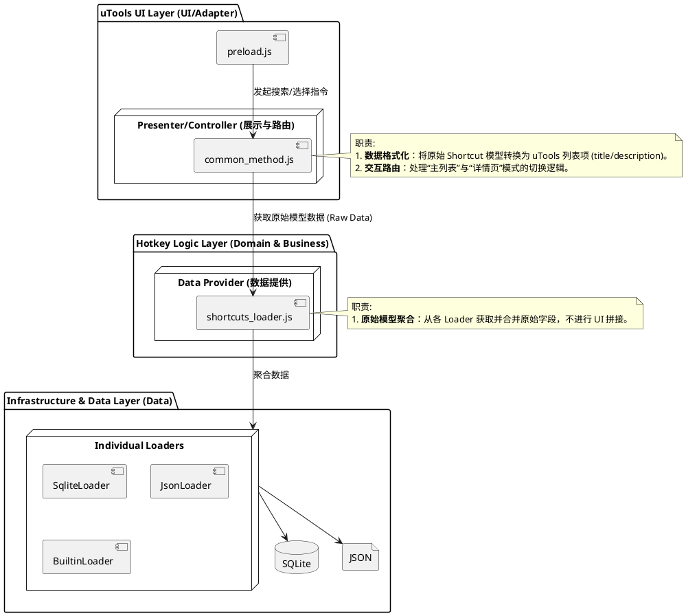
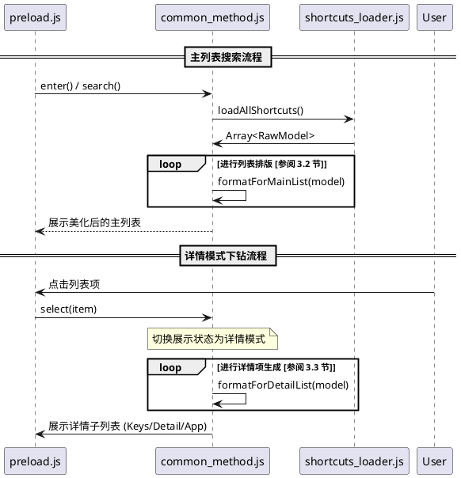

# 规格说明书 (Spec) - 00007: 处理超长快捷键说明与详情模式

## 1. 问题描述 (Problem)
从网络（如 hotkeycheatsheet.com）拉取的快捷键说明文字长度差异巨大。在 uTools 列表视图中，如果文字过长，会导致以下问题：
1.  **标题截断**：最重要的快捷键组合（Keys）由于被放在标题末尾，往往被 `...` 遮挡无法直接查看。
2.  **视觉混乱**：一行内塞入过多信息，用户难以快速捕捉核心功能。
3.  **信息缺失**：截断后的文字可能导致用户无法完整理解该快捷键的具体用途。

## 2. 目标 (Goals)
- **快捷键始终可见**：无论动作名多长，用户必须在列表的第一眼就能看到快捷键（例如 `Ctrl+R`）。
- **完整说明可触达**：提供一种简单的方式，让用户在需要时能查看超长动作的完整中文描述。
- **一致的交互体验**：参考“剪贴板历史”插件，使用符合直觉的 uTools 列表下钻交互。

## 3. 设计方案 (Design)

### 3.1 目标架构组件图 (Target Architecture)
为了实现“数据-显示”分离，系统将引入 `Presenter` 层（视图呈现层），确保原始数据的完整性与显示多样性的解耦。


### 3.1.1 核心分工与重构点 (Key Responsibilities & Refactoring)

为了在最小化代码变动的情况下实现目标，当前迭代的核心是将“数据获取”与“视觉排版”彻底解耦：

| 维度 | 当前系统 (Current) | 本次迭代改动 (Draft) | 关键分工 |
| :--- | :--- | :--- | :--- |
| **数据源 (Loader)** | 返回已拼接好展示文本的 `title` 和 `description` 对象数组。 | `shortcuts_loader.js` 仅返回包含原始字段（Action, Keys, App）的 Raw 模型。 | **数据提供者**：负责聚合但不负责格式化。 |
| **呈现层 (Presenter)** | 直接使用从 Loader 返回的字符串进行显示。 | `common_method.js` 内部（或辅助类）根据上下文动态生成格式化字符串。 | **视图控制者**：负责根据模式（列表/详情）生成视觉样式。 |

**关键重构点：**
1. **Raw 数据透传**：重写 `shortcuts_loader.js` 的聚合逻辑，使其返回结构化的原始模型。
2. **列表格式化重构**：在 `common_method.js.enter` 中对原始模型按照 [3.2 节](#32-列表视图优化-list-view-formatting) 进行格式化。
3. **交互路由实现**：在 `common_method.js.select` 中增加模式判断，若满足条件则跳转至详情列表而非执行动作。

### 3.2 列表视图优化 (List View Formatting)
通过新的 `Presenter` 对 `title` 和 `description` 字段进行重新排版：
-   **字段：title** -> 仅保留“动作名称”，且如果长度超过 15 个字则进行智能截断（Ellipsis）。
-   **字段：description** -> 格式转变为：`[快捷键组合] 所属应用 - 备注说明`。
    -   *示例*：`[Ctrl + Alt + Shift + →] Magnet - 将窗口移动到下一个屏幕并充满全屏`
-   **优势**：通过将 `[快捷键]` 放在备注最左侧，确保在任何屏幕尺寸下快捷键都清晰可见。

### 3.3 详情页模式 (Details Sub-list)
模仿“剪贴板历史”的详情查看交互：
-   **入口**：当用户在主列表中选中或点击某项（或长按/指定键），进入该项的“详情页面”。
-   **内容展示**：由 `Presenter` 生成一个详情子列表：
    1.  **第一项 (快捷键)**: `title: "Ctrl + Alt + Shift + →"`, `description: "快捷键内容"`
    2.  **第二项 (完整动作说明)**: `title: "完整描述"`, `description: "将当前激活的窗口移动到下一个监控器，并使其全屏展示。"`
    3.  **第三项 (所属应用信息)**: `title: "所属应用: Magnet"`, `description: "数据来源: hotkeycheatsheet"`
    4.  **第四项 (操作选项)**: `title: "立即执行"`, `action: "execute"`
    5.  **第五项 (返回列表)**: `title: "↩ 返回搜索"`, `action: "back"`
 
### 3.4 核心逻辑交互设计 (Core Logic Interaction)

#### 3.4.1 接口契约说明 (Interface Contract)

在本次迭代中，`shortcuts_loader.js` 输出的数组元素需遵循以下原始数据模型：

```json
{
  "title": "原始动作名 (如: Move current window)",
  "keys": ["command", "shift", "right"],
  "description": "原始备注或分类说明",
  "appName": "应用名称 (如: Magnet)",
  "appId": "应用标识",
  "icon": "图标数据/路径",
  "category": "所属分类"
}
```

#### 3.4.2 搜索与详情切换流程 (Detailed Sequence)



## 4. 单元测试设计 (Unit Test Design)
 
为了确保重构后的分工（数据提供与视图呈现分离）工作正常，需增加以下单元测试。
 
### 4.1 核心组件测试 (Component Tests)
 
#### 4.1.1 `shortcuts_loader.js`: 原始模型验证
*   **用例：Raw 数据聚合验证**
    *   *输入*：模拟的内置 JSON 与 SQLite 加载器数据。
    *   *预期*：返回的对象数组中，每个项必须包含 `keys` (数组), `appName` (字符串) 且 `title` 仅包含动作名称本身。
*   **用例：优先级去重验证**
    *   *输入*：同时存在内置与 SQLite 版本的同一应用 (appId)。
    *   *预期*：SQLite 版本的快捷键应根据优先级策略正确覆盖或补充内置版本。
 
#### 4.1.2 `common_method.js`: 视图转换验证
*   **用例：主列表排版验证 (`formatForMainList`)**
    *   *输入*：原始模型 `{title: "Copy", keys: ["cmd", "c"]}`。
    *   *预期*：输出 description 为 `[Cmd + C] ...` (符合 3.2 节规范)。
*   **用例：详情页下钻验证 (`formatForDetailList`)**
    *   *输入*：任一原始模型。
    *   *预期*：输出包含 5 个子项的数组，且每一项的 title/description 符合 3.3 节规格定义。
 
#### 4.1.3 交互路由验证
*   **用例：DETAILS 模式重置**
    *   *预期*：用户在详情模式下进行新的关键词搜索（`search` 函数被再次调用）时，内部状态应自动从 `DETAILS` 模式切换回 `MAIN_LIST` 模式。
 
### 4.2 环境 Mock 策略
*   **utools API**：通过全局 `global.utools` 模拟数据库存取和系统判定逻辑。
*   **文件系统**：测试应指向 `test/mock_config` 目录以避免读写真实配置文件。

## 5. 验收标准 (Acceptance Criteria)
- [ ] 列表中的备注字段开头必须显示 `[快捷键]`。
- [ ] 即使在极短的 uTools 窗口下，快捷键也不得被截断消失。
- [ ] 点击列表项后，能进入详情子列表，并展示完整说明。
- [ ] 在详情页中点击“立即执行”或“返回”应逻辑正确。

## 6. 测试案例 (Test Cases)
- **场景：超长标题** - 测试 Magnet 的“Move current window to next...”快捷键。
- **场景：多键组合** - 测试包含 4 个修饰符的组合键显示。
- **场景：极简标题** - 确认短动作（如 "Copy"）在详情模式下的显示依然美观。
