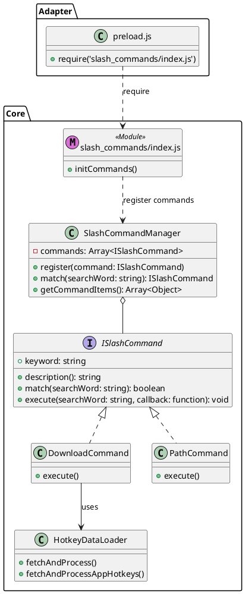

# spec-00008-refactor-hotkey_service

## 目标
将 `/download` 和 `/path` 命令的实现从 `src/core/hotkeycheatsheet.js` 中抽离，移动到独立的 Slash Command 目录中。目的是实现命令逻辑与业务服务逻辑的解耦，提高代码的可维护性和扩展性，符合 `.antigravity/development_standards.md` 中的“命令分发模式”规范。

## 用户流程
本重构为架构优化，不改变现有的用户交互流程：
1. 用户在 uTools 搜索框输入 `/download`。
2. 插件展示远程应用列表供选择下载。
3. 用户输入 `/path`。
4. 插件弹出文件夹选择框以设置数据库存储路径。

## 详细设计

### 1. 架构调整
- **src/core/hotkeycheatsheet.js**: 保留 `HotkeyCheatsheetParser` 和 `HotkeyDataLoader`，作为纯粹的数据服务层。
- **src/core/slash_commands/**: 新建目录，专门存放斜线命令。
    - **index.js**: 命令注册入口，负责加载并注册所有命令。
    - **download.js**: 封装 `/download` 命令逻辑。
    - **path.js**: 封装 `/path` 命令逻辑。
- **src/adapter/preload.js**: 修改模块加载方式，由加载 `hotkeycheatsheet.js` (核心逻辑) 和 `slash_commands/index.js` (命令逻辑) 组成。

### 2. 类图 (PlantUML)

### 3. 代码修改点描述

- **src/core/hotkeycheatsheet.js** (重命名自 `src/core/hotkey_service.js`):
    - 保留 `HotkeyCheatsheetParser` 和 `HotkeyDataLoader` 类。
    - 仅导出 `dataLoader` 实例。
    - 移除 `DownloadCommand` 和 `PathCommand` 类的定义及相关的 `slashCommandManager.register` 调用。
- **src/core/slash_commands/download.js** (新增):
    - 迁移原 `DownloadCommand` 类。
    - 引用 `../hotkeycheatsheet.js` 模块以获取 `dataLoader` 实例。
- **src/core/slash_commands/path.js** (新增):
    - 迁移原 `PathCommand` 类。
    - 引用 `../infrastructure/sqlite_service.js` 和 `path`、`fs` 等 Node.js 模块。
- **src/core/slash_commands/index.js** (新增):
    - 引入 `slashCommandManager`。
    - 引入并实例化 `DownloadCommand` 与 `PathCommand`。
    - 执行注册操作：`slashCommandManager.register(...)`。
- **src/adapter/preload.js**:
    - 将 `require('../core/hotkey_service.js')` 更改为 `require('../core/hotkeycheatsheet.js')` 和 `require('../core/slash_commands/index.js')`。
    - 同步更新其他地方对 `hotkey_service.js` 的引用。

### 4. 存储与 UI 细节
- **存储**: `PathCommand` 继续使用 `utools.dbStorage` 读写 `sqlite_db_path`。
- **UI**: 保持 `utools.showOpenDialog` 和 `callbackSetList` 的反馈机制。

## 测试设计
- **功能路径测试**: 
  - 输入 `/download` 后能正常加载远程列表。
  - 输入 `/path` 后能正常唤起路径选择并更新配置。
- **回归测试**: 
  - 确保主搜索功能不受影响。
  - 确保跨平台（Mac/Win）下的兼容性。

## 任务拆分
- [ ] 创建目录 `src/core/slash_commands/`
- [ ] 提取 `DownloadCommand` 类到 `src/core/slash_commands/download.js`
- [ ] 提取 `PathCommand` 类到 `src/core/slash_commands/path.js`
- [ ] 创建 `src/core/slash_commands/index.js` 统一管理注册逻辑
- [ ] 将 `src/core/hotkey_service.js` 重命名为 `src/core/hotkeycheatsheet.js` 并清理，移除命令类及其注册代码
- [ ] 更新 `src/adapter/preload.js` 的引用
- [ ] 手动验证两个命令的各项功能是否正常