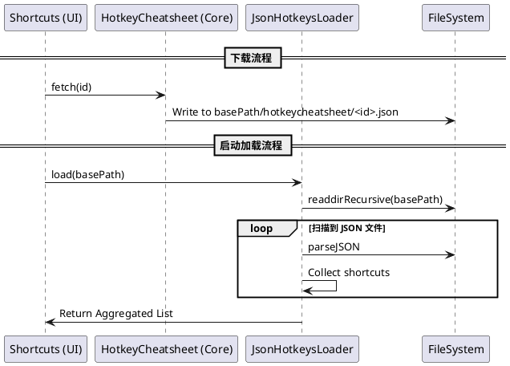
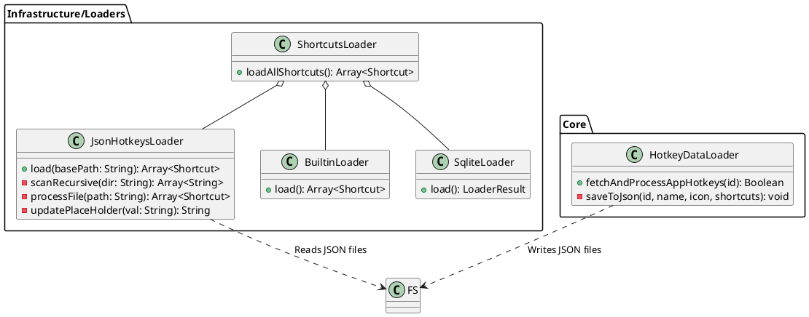

# Spec-00010: 统一快捷键数据格式与本地 JSON 存储

## 目标
统一格式化从 hotkeycheatsheet.com 获取的快捷键数据，并将其以应用为单位保存为本地 JSON 文件。
- 实现数据的物理存储，增强数据的可迁移性与可编辑性。
- 在应用启动时自动加载所有本地 JSON 快捷键数据。
- 采用统一的 JSON Schema 以确保各数据源的一致性。

## 用户流程
1. **下载/更新数据**:
   - 用户使用 `/download` 命令搜索并下载特定应用的快捷键。
   - 插件从 hotkeycheatsheet.com 拉取 HTML 并解析为标准化格式。
   - 插件将该应用的所有快捷键连同图标、更新时间等元数据写入本地 `hotkeycheatsheet/<appId>.json` 文件。
2. **启动加载**:
   - 插件启动时，`ShortcutsLoader` 递归加载配置目录下的所有 JSON 文件。
   - 读取并解析文件内容，并将其加载到全局快捷键列表中供用户搜索。

## 详细设计

### 1. 统一 JSON 数据格式 (Standardized Schema)
每个应用的 JSON 文件将遵循以下结构：
```json
{
  "appId": "vscode", // 来源于 hotkeycheatsheet 的 slug
  "appName": "Visual Studio Code",
  "icon": "data:image/png;base64,...", // 应用图标 Base64
  "updatedAt": 1711550000000,
  "shortcuts": [
    {
      "title": "Copy (ctrl + c)",
      "description": "Visual Studio Code (hotkeycheatsheet)",
      "keys": ["ctrl", "c"],
      "keyword": "visual studio code vscode main copy",
      "category": "Main",
      "icon": "data:image/png;base64,..." 
    }
  ]
}
```

#### 1.1 统一架构重构设计 (Unified Architecture Design)
本项目将彻底统一外部 JSON 的存储与读取架构，**不再保留对旧版纯数组格式的兼容**：
- **强制对象结构**: 所有外部 JSON 数据源（包括用户自定义及程序下载）必须遵循 `{ "shortcuts": [...] }` 的对象结构。
- **解析逻辑统一**: `JsonHotkeysLoader.js` 将处理所有第三方 JSON 数据源，严格按包含元数据的字段提取快捷键列表。
- **数据一致性**: 对于历史存在的快捷键数据，建议用户按上述 Schema 进行格式更新，确保所有数据源都具备 `appId`、`appName` 等关键索引字段。

#### 1.2 重构与实现逻辑 (Refactoring & Implementation Logic)
- **JsonHotkeysLoader 全面重构**:
  - **统一加载器**: 废弃专门的下载加载器设计，由 `JsonHotkeysLoader` 承担所有外部 JSON 数据的加载工作。
  - **递归目录扫描**: 对配置的 `basePath` 进行递归遍历，自动识别并加载所有子目录（如 `json_hotkeys/`、`hotkeycheatsheet/`）下的 `.json` 文件。
  - **Meta Schema 强制校验**: 严格按 `{ "shortcuts": [...] }` 对象结构解析，并提取元数据用于全局 appId/appName 的索引与去重。
- **公共解析逻辑提取**:
  - 将 `updatePlaceHolder` 等占位符处理逻辑提取为 `JsonHotkeysLoader` 的私有或静态方法，确保所有来源的快捷键处理逻辑一致。
- **hotkeycheatsheet.js 实现**:
  - 导出符合新统一 Schema 的 JSON 文件至指定子目录，利用 `JsonHotkeysLoader` 的递归扫描特性实现“即存即用”。

### 2. 逻辑架构 (PlantUML)

#### 2.1 交互流程 (Sequence Diagram)



#### 2.2 类设计 (Class Diagram)



#### 2.3 软件设计详细说明
- **ShortcutsLoader (高层聚合器)**: 采用外观模式 (Facade)，负责协调所有底层加载器（Builtin, Sqlite, Json）。它的核心职责是在内存中合并所有数据，并根据 `appId` 执行全局去重逻辑，确保“自定义 JSON”优先级最高。
- **JsonHotkeysLoader (核心加载引擎)**: 本方案的重构重点。它将演变为一个具备**通用性与可扩展性**的加载器：
  - **职责**: 负责扫描、读取、校验并解析物理磁盘上的所有 JSON 快捷键文件。
  - **核心能力**: 内置递归目录扫描算法 (`scanRecursive`)，打破原有的单目录限制。
  - **扩展性**: 通过将占位符处理（`updatePlaceHolder`）和文件解析逻辑原子化，方便未来增加更复杂的 Schema 校验。
- **HotkeyDataLoader (数据供应者)**: 位于 `Core` 层，专注于从 hotkeycheatsheet.com 获取并转换数据。**重构后，下载流程将完全弃用 SQLite 存储，直接产出符合 Schema 的 JSON 实体文件**。原有的 SQLite 逻辑将被移除或转为不活跃状态。

**重构优先级说明**:
在实施新功能前，**必须优先重构 `JsonHotkeysLoader`**。通过提升其对不同子目录（`json_hotkeys` 和 `hotkeycheatsheet`）的递归加载能力和对新 Object Schema 的解析鲁棒性，为后续所有本地数据拓展提供坚实的底层支撑。

### 3. 软件单元设计 (Software Unit Design)

#### 3.1 JsonHotkeysLoader 单元
- **`load(basePath)`**:
  - 核心入口。接收外部存储基准目录。
  - 调用 `scanRecursive` 获取所有 JSON 文件路径。
  - 遍历路径并汇总由 `processFile` 返回的快捷键数组。
- **`scanRecursive(dir)`**:
  - 内部递归方法。使用 `fs.readdirSync` 和 `fs.statSync`。
  - 深度优先或广度优先遍历所有子目录。
  - 过滤出所有以 `.json` 结尾的文件完整路径。
- **`processFile(filePath)`**:
  - 负责单文件处理。
  - 读取内容并执行 `JSON.parse`。
  - 严格校验 Root 结构是否包含 `shortcuts` 字段。
  - 若符合 Schema，则对 `shortcuts` 数组中的每一项调用 `processItem`。
- **`processItem(item)`**:
  - 快捷键项标准化。
  - 确保包含 `title`, `keys`, `keyword` 等基础字段。
  - 调用 `updatePlaceHolder` 处理跨平台占位符。
- **`updatePlaceHolder(val)`**:
  - 字符串处理单元。根据 `utools.isMacOs()` 等环境，将 `{cmd_or_ctrl}` 等替换为物理按键名称。

#### 3.2 ShortcutsLoader 单元
- **聚合逻辑**:
  - 调用各 Loader 并获取结果。
  - 维护一个全局的 `appId` 到 `ShortcutGroup` 的索引，用于在内存中执行覆盖式去重（自定义 JSON 文件中的 appId 若与内置重复，则覆盖内置）。

## 测试设计
- **用例 1**: 验证放置在深层目录（如 `hotkeycheatsheet/subfolder/app.json`）的数据是否也能被正确加载。
- **用例 2**: 验证非对象格式（如旧版数组格式）的文件是否被正确忽略（严格执行新 Schema）。
- **用例 3**: 验证重复的 `appId` 是否能按照加载顺序正确去重。
