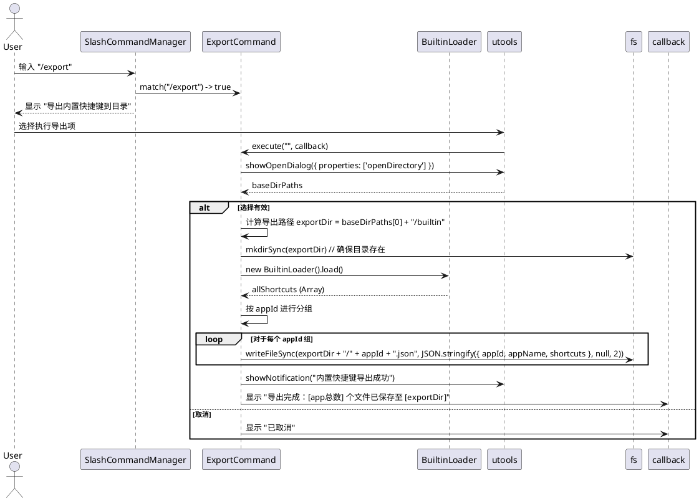
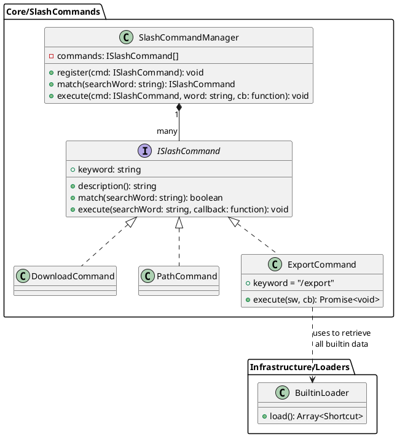

# SPEC-00011: 导出内置快捷键到 JSON 目录

## 1. 目标
为用户提供导出插件内置快捷键数据的功能。导出时按应用进行拆分，将数据保存到指定的 `builtin` 目录下，以便于用户备份、参考或作为自定义 JSON 快捷键源。

## 2. 用户流程
1. **唤起命令**: 用户在 uTools 主界面搜索框输入 `/export`。
2. **选择任务**: 插件展示 `/export 导出内置快捷键到目录` 列表项。
3. **触发对话框**: 用户点击或回车，插件弹出系统 **选择目录对话框**。
4. **准备目录**: 用户选择一个父目录，插件在该目录下自动创建 `builtin` 子目录（如果已存在则复用）。
5. **保存数据**: 插件读取当前平台的内置快捷键数据，按应用分组，每个应用生成一个 `{appId}.json` 文件（例如 `vscode.json`, `obsidian.json`）。
6. **成功反馈**: 弹出 uTools 通知提示“导出成功”，并在插件列表显示导出结果摘要。

## 3. 详细设计

### 3.1 逻辑架构
- **ExportCommand**: 处理导出逻辑。
- **BuiltinLoader**: 提供当前平台的原始数据。
- **Data Structuring**: 在导出时将扁平数据按 `appId` 重新分组，并填充符合 SPEC-00010 规范的 JSON 结构。

### 3.2 交互逻辑 (PlantUML)

### 3.3 软件架构类图 (PlantUML)

### 3.4 模块变更说明

#### 新增组件
- **ExportCommand** (`src/core/slash_commands/export.js`): 
  - 实现命令分发模式下的导出功能。
  - 核心逻辑：弹出目录选择对话框 -> 创建 `builtin` 目录 -> 获取内置数据并按 `appId` 分组 -> 遍历写入 JSON 文件。

#### 图标处理策略
- **图标采样**: 虽然 `load()` 返回的扁平数组中每个快捷键都有 `icon` 字段，但通常同一应用的快捷键指向同一个图标文件。导出逻辑将从每个应用组中采样第一个图标路径。
- **文件复制**: 在 `builtin/` 目录下创建一个 `icons/` 子目录。导出程序将根据原始路径（相对于插件根目录）读取图标文件，并将其统一复制到 `builtin/icons/` 目录下。
- **路径重映射**: 在生成的 `{appId}.json` 文件（位于 `builtin/`）中，所有快捷键的 `icon` 字段将重写为相对于 JSON 文件的路径，即 `icons/appId.png`（例如 `icons/vscode.png`）。
- **兼容性**: 这样做确保了导出目录 `builtin` 可以作为一个独立的文件夹被移动到用户的 `json_hotkeys/` 目录中，且依然能正确显示图标。

#### 现有代码修改
- **加载优先级与 App 冲突消解** (`src/infrastructure/shortcuts_loader.js`):
  - 当同一应用存在于多个数据源时，按以下优先级保留数据，丢弃低优先级源的重复条目：
    1. **json_hotkeys**（用户自定义 JSON）— 最高优先级
    2. **builtin**（插件内置数据）— 次优先级
    3. **hotkeycheatsheet**（在线下载数据）— 最低优先级
  - **App 名称归一化规则**：不同数据源对同一应用的命名可能存在差异（例如 builtin 使用 `vscode`，hotkeycheatsheet 使用 `visual-studio-code`；builtin 使用 `jet_brains`，hotkeycheatsheet 使用 `intellij-idea`）。在进行冲突检测时，需要对 app 名称执行以下归一化转换：
    - 统一转小写
    - 移除分隔符（`_`, `-`, ` `）后比较
    - 维护一个 alias 映射表，将已知的跨源别名映射到统一的 canonical ID（例如 `jet_brains` ↔ `intellij-idea`，`vscode` ↔ `visual-studio-code`）
  - 当前的 `downloadedSet` 仅基于精确 `appId` 匹配做去重，需要增强为基于归一化后的 key 进行冲突判定。
- **Slash Command 入口** (`src/core/slash_commands/index.js`):
  - 导入 `ExportCommand` 并在 `initCommands()` 中调用 `slashCommandManager.register()` 进行注册。
- **内置加载器** (`src/infrastructure/loaders/builtin_loader.js`):
  - 无需修改核心逻辑，但需确保其 `load()` 方法返回的数据结构包含足够的 `appId` 信息以便分组。

## 4. 测试设计

### 4.1 单元测试 (Unit Tests)
由于 `ExportCommand` 涉及 I/O 和 uTools API，单元测试应侧重于核心逻辑的正确性：
- **匹配逻辑验证**: 验证 `match('/export')` 返回 `true`，非以此开头的返回 `false`。
- **数据分组逻辑**: 编写独立的测试用例（或提取私有方法进行测试），输入一组包含不同 `appId` 的扁平快捷键数组，验证是否能正确生成按 `appId` 索引的对象映射。
- **Schema 完整性**: 验证生成的 JSON 对象是否包含 `appId`, `appName`, `updatedAt` 和 `shortcuts` 四个核心字段。
- **Mock 依赖**:
  - Mock `utools.showOpenDialog` 以模拟用户选择目录或取消操作。
  - Mock `fs` 模块（使用 `memfs` 或简单的 `jest.spyOn`）以防止在测试期间产生真实的磁盘 I/O。
  - Mock `BuiltinLoader.load()` 返回受控的测试数据集。

### 4.2 集成测试与验证 (Manual Verification)
- **目录创建测试**: 验证是否正确创建了 `builtin` 文件夹。
- **文件拆分测试**: 验证 `builtin` 下是否产生了多个 `.json` 文件（如 `vscode.json`, `obsidian.json` 等）。
- **内容验证**: 打开其中一个文件，验证其符合 `{ appId, appName, updatedAt, shortcuts }` 结构。
- **覆盖测试**: 如果再次导出到同一位置，验证文件是否被正确覆盖。
