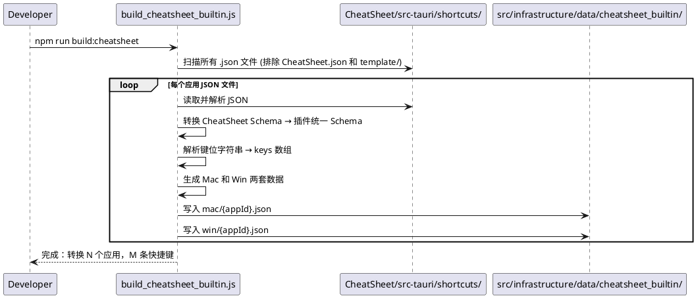
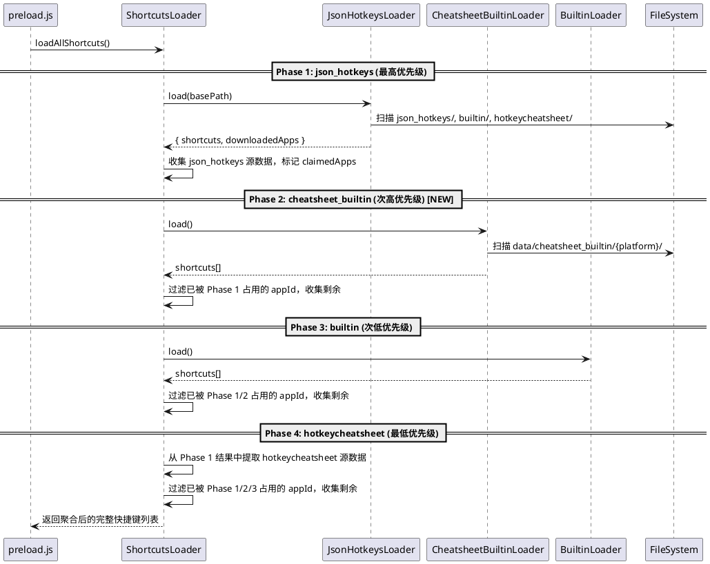
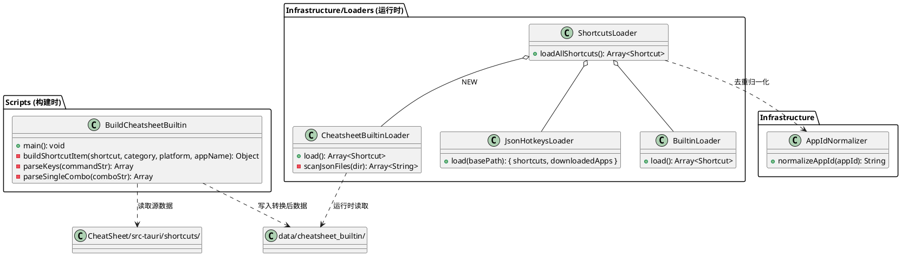

# SPEC-00012: 内置 CheatSheet 快捷键数据支持

## 1. 目标

解析 `CheatSheet/src-tauri/shortcuts/` 目录中由 CheatSheet 桌面端维护的高质量快捷键 JSON 数据，通过**构建时预处理脚本**将其转换为插件运行时所需的统一格式，随插件一起打包分发。插件启动时由一个新的专用加载器（`CheatsheetBuiltinLoader`）将这些预生成数据加载到全局快捷键列表中。

**加载优先级**（从高到低）：
1. `json_hotkeys`（用户自定义 JSON）
2. **`cheatsheet_builtin`**（本 Spec 新增，CheatSheet 桌面端数据）
3. `builtin`（原有插件内置硬编码数据）
4. `hotkeycheatsheet`（在线下载数据）

## 2. 用户流程

1. **开发阶段（构建时）**：
   - 开发者在 `CheatSheet/src-tauri/shortcuts/` 目录中维护各应用的快捷键 JSON 文件（遵循 CheatSheet Schema）。
   - 执行构建脚本 `npm run build:cheatsheet`，脚本读取所有 CheatSheet JSON 并转换为插件统一 Schema，输出到 `src/infrastructure/data/cheatsheet_builtin/` 目录。
   - 转换后的数据文件随项目代码一起提交到 Git 仓库，并在插件打包时一并分发。

2. **运行阶段（启动时）**：
   - 插件启动，`ShortcutsLoader` 调度所有加载器。
   - `CheatsheetBuiltinLoader` 扫描 `src/infrastructure/data/cheatsheet_builtin/` 目录，加载预生成的 JSON 文件。
   - 数据按优先级进行聚合去重后展示给用户搜索使用。

## 3. 详细设计

### 3.1 数据格式转换

#### 3.1.1 CheatSheet 源数据 Schema
`CheatSheet/src-tauri/shortcuts/` 中的原始文件遵循如下结构：
```json
{
  "$schema": "./template/shortcut.schema.json",
  "name": "Google Chrome",
  "categories": [
    {
      "name": "标签页",
      "shortcuts": [
        {
          "command": { "win": "Ctrl+N", "mac": "Command+N", "linux": "Ctrl+N" },
          "description": "打开新窗口"
        }
      ]
    }
  ]
}
```

#### 3.1.2 插件统一 Schema（目标格式）
转换后输出到 `src/infrastructure/data/cheatsheet_builtin/` 的文件遵循 SPEC-00010 的统一 Schema：
```json
{
  "appId": "google-chrome",
  "appName": "Google Chrome",
  "updatedAt": 1711550000000,
  "shortcuts": [
    {
      "title": "打开新窗口 Command+N",
      "description": "打开新窗口",
      "keys": ["n", "command"],
      "keyword": "google chrome 标签页 打开新窗口",
      "category": "标签页"
    }
  ]
}
```

#### 3.1.3 转换规则

| 源字段 | 目标字段 | 转换逻辑 |
|--------|----------|----------|
| `name` | `appId` | 转小写，空格替换为 `-`（例如 `"Google Chrome"` → `"google-chrome"`） |
| `name` | `appName` | 直接保留原始名称 |
| — | `updatedAt` | 构建脚本执行时的时间戳 `Date.now()` |
| `categories[].name` | `shortcuts[].category` | 直接映射 |
| `categories[].shortcuts[].description` | `shortcuts[].description` | 直接映射 |
| `categories[].shortcuts[].description` + 平台键位 | `shortcuts[].title` | `"{description} {platformKeys}"`（例如 `"打开新窗口 Command+N"`） |
| `categories[].shortcuts[].command.mac/win` | `shortcuts[].keys` | 解析键位字符串为数组（详见 3.1.4） |
| `name` + `categories[].name` + `description` | `shortcuts[].keyword` | 拼接为搜索关键词（小写） |

#### 3.1.4 键位字符串解析规则

将 CheatSheet 的 `command` 字符串（如 `"Ctrl+Shift+N"`）解析为插件运行时使用的 `keys` 数组（如 `["n", "shift", "ctrl"]`）。

**解析步骤**：
1. 按 `+` 分割键位字符串。
2. 各个键名统一转为小写。
3. 识别修饰键（`ctrl`, `command`, `shift`, `option`, `alt`）和主键，将主键放在数组首位，修饰键在后（这是 `utools.simulateKeyboardTap` 的要求）。
4. 对含 `|`（多功能键）的情形：取第一个组合作为 `keys`，将完整字符串保留在 `title` 中。
5. 对含 `&`（组合键）的情形：拆分为多组 keys 数组，生成 `keys: [["k1", "mod1"], ["k2", "mod2"]]` 的嵌套结构。

**平台选择策略**：
- 构建脚本同时生成 Mac 和 Windows 两套数据，按平台分子目录存放：
  ```
  src/infrastructure/data/cheatsheet_builtin/
  ├── mac/
  │   ├── google-chrome.json
  │   ├── intellij-idea.json
  │   ├── visual-studio-code.json
  │   └── ...
  └── win/
      ├── google-chrome.json
      ├── intellij-idea.json
      ├── visual-studio-code.json
      └── ...
  ```
- Mac 版本读取 `command.mac` 字段，输出到 `mac/` 子目录。
- Windows 版本读取 `command.win` 字段，输出到 `win/` 子目录。
- 如果某平台字段缺失，则跳过该条快捷键（不写入该平台的输出文件）。
- 运行时 `CheatsheetBuiltinLoader` 根据 `utools.isMacOs()` 判断当前平台，仅加载对应子目录的文件。

#### 3.1.5 应用过滤策略

`CheatSheet/src-tauri/shortcuts/` 中包含 `CheatSheet.json`（CheatSheet 软件自身的快捷键说明，非实际应用快捷键）。构建脚本应排除此文件，不将其纳入转换输出。

### 3.2 构建时预处理脚本设计

#### 3.2.1 脚本入口

新增 `scripts/build_cheatsheet_builtin.js`，在 `package.json` 中注册为：
```json
{
  "scripts": {
    "build:cheatsheet": "node scripts/build_cheatsheet_builtin.js",
    "test": "mocha"
  }
}
```


### 3.3 运行时加载器设计

#### 3.3.1 新增 CheatsheetBuiltinLoader

新建文件 `src/infrastructure/loaders/cheatsheet_builtin_loader.js`。

**职责**：扫描 `src/infrastructure/data/cheatsheet_builtin/{platform}/` 目录，读取预生成的 JSON 文件，返回统一格式的快捷键数组。


### 3.4 ShortcutsLoader 聚合逻辑变更

修改 `src/infrastructure/shortcuts_loader.js` 中的优先级与聚合逻辑。

#### 3.4.1 新增优先级阶段

在现有的 Phase 1 (json_hotkeys) 和 Phase 2 (builtin) 之间，插入新的阶段：

```
Phase 1:  json_hotkeys       (JsonHotkeysLoader, _source='json_hotkeys')  — 最高
Phase 2:  cheatsheet_builtin (CheatsheetBuiltinLoader)                   — 次高 [NEW]
Phase 2b: builtin exported   (JsonHotkeysLoader, _source='builtin')      — 次次
Phase 3:  builtin hardcoded  (BuiltinLoader)                             — 次低
Phase 4:  hotkeycheatsheet   (JsonHotkeysLoader, _source='hotkeycheatsheet') — 最低
```

#### 3.4.2 去重策略 (Deduplication)

为了确保同一个应用（App）的快捷键不被重复加载，`ShortcutsLoader` 采用“**高优先级占位 (Claim-first)**”的合并策略：

1. **归一化匹配**：所有加载出的快捷键首先通过 `AppIdNormalizer` 对其 `appId` 进行归一化处理（转小写、移除特殊字符、别名映射），生成全局唯一的 Canonical ID。
2. **优先级遍历**：按照 Phase 1 到 Phase 4 的顺序依次遍历各加载器的结果。
3. **占位过滤 (claimedApps)**：
   - 维护一个内存 Set (`claimedApps`) 记录已经成功加载的应用 Canonical ID。
   - 当处理后续阶段（如 Phase 2）的数据时，若某个应用的 ID 已经在 `claimedApps` 中存在，则说明该应用已由更高优先级的数据源（如用户的自定义 JSON）提供，**当前阶段的所有属于该应用的数据将被直接丢弃**。
   - 只有尚未被“占位”的应用数据才会被添加进最终列表，并将其 ID 存入 `claimedApps`Set 中以屏蔽后续低优先级的相同应用。

这种策略确保了无论数据源如何增加，用户都只看到每个应用中该平台认为“最权威”或“最新”的的一套快捷键数据。


### 3.5 App ID 归一化扩展

在 `src/infrastructure/app_id_normalizer.js` 的 `ALIAS_GROUPS` 中，需要为 CheatSheet 数据源的应用名与现有数据源建立映射，确保跨源去重正确生效。

**需要新增的别名组**：
```javascript
const ALIAS_GROUPS = [
    ['vscode', 'visual-studio-code', 'visualstudiocode'],
    ['jet_brains', 'intellij-idea', 'jetbrains'],
    // NEW: CheatSheet 数据源的名称映射
    ['google-chrome', 'googlechrome', 'chrome'],
    ['microsoft-excel', 'microsoftexcel', 'excel', 'office_excel'],
    ['microsoft-word', 'microsoftword', 'word', 'office_word'],
    ['microsoft-powerpoint', 'microsoftpowerpoint', 'powerpoint', 'office_ppt'],
    ['sublime-text', 'sublimetext'],
    ['navicat-premium', 'navicatpremium'],
    ['phpstorm', 'php-storm'],
    ['pycharm', 'py-charm'],
    ['webstorm', 'web-storm'],
    ['microsoft-visual-studio', 'microsoftvisualstudio', 'visualstudio'],
];
```

### 3.6 逻辑架构图 (PlantUML)

#### 3.6.1 构建时数据流图 (Sequence Diagram)



#### 3.6.2 运行时加载流程 (Sequence Diagram)



#### 3.6.3 类设计图 (Class Diagram)



### 3.7 文件变更清单

| 操作 | 文件路径 | 说明 |
|------|---------|------|
| **新增** | `scripts/build_cheatsheet_builtin.js` | 构建时预处理脚本 |
| **新增** | `src/infrastructure/loaders/cheatsheet_builtin_loader.js` | 运行时 CheatSheet 内置数据加载器 |
| **新增** | `src/infrastructure/data/cheatsheet_builtin/mac/*.json` | 构建产物：Mac 平台预处理数据 |
| **新增** | `src/infrastructure/data/cheatsheet_builtin/win/*.json` | 构建产物：Windows 平台预处理数据 |
| **修改** | `src/infrastructure/shortcuts_loader.js` | 在聚合逻辑中新增 Phase 2 阶段 |
| **修改** | `src/infrastructure/app_id_normalizer.js` | 新增 CheatSheet 应用名的别名映射 |
| **修改** | `package.json` | 注册 `build:cheatsheet` 脚本 |

## 4. 测试设计

### 4.1 构建脚本单元测试

**测试文件**: `test/test_build_cheatsheet.js`

- **用例 1 — 键位解析（简单组合键）**：
  - 输入：`"Ctrl+Shift+N"`
  - 预期输出：`["n", "shift", "ctrl"]`

- **用例 2 — 键位解析（多功能键 `|`）**：
  - 输入：`"F5 | Ctrl+R"`
  - 预期输出：`["f5"]`（取第一个组合）

- **用例 3 — 键位解析（组合键 `&`）**：
  - 输入：`"Alt+Space & N"`
  - 预期输出：`[["space", "alt"], ["n"]]`

- **用例 4 — appId 生成**：
  - 输入 `name = "Google Chrome"`
  - 预期 `appId = "google-chrome"`

- **用例 5 — 平台过滤**：
  - 验证仅含 `command.mac` 的快捷键不会出现在 win 输出中。

- **用例 6 — CheatSheet.json 排除**：
  - 验证 `CheatSheet.json` 文件不参与转换。

- **用例 7 — title 生成**：
  - 输入 `description="打开新窗口"`, `command.mac="Command+N"`
  - 预期 `title = "打开新窗口 Command+N"`

- **用例 8 — keyword 生成**：
  - 输入 `appName="Google Chrome"`, `categoryName="标签页"`, `description="打开新窗口"`
  - 预期 `keyword` 包含 `"google chrome 标签页 打开新窗口"`（全小写）

### 4.2 CheatsheetBuiltinLoader 单元测试

**测试文件**: `test/test_cheatsheet_builtin_loader.js`

- **用例 1 — 正常加载**：
  - 在临时目录中放置若干符合 Schema 的 JSON 文件，验证 `load()` 返回正确数量的快捷键且每条都包含 `appId`。

- **用例 2 — 空目录**：
  - 当数据目录为空或不存在时，`load()` 返回空数组，不抛错。

- **用例 3 — 非法 JSON 文件**：
  - 在数据目录中放置格式错误的 JSON，验证该文件被跳过，其他文件仍正常加载。

### 4.3 ShortcutsLoader 集成测试

**测试文件**: `test/test_shortcuts_loader.js`（在现有文件中追加用例）

- **用例 — CheatSheet 优先级验证**：
  - 当同一应用同时存在于 `cheatsheet_builtin` 和 `builtin` 中时，只保留 `cheatsheet_builtin` 的数据。
  - 当同一应用同时存在于 `json_hotkeys` 和 `cheatsheet_builtin` 中时，只保留 `json_hotkeys` 的数据。

### 4.4 集成验证（手动）

- **端到端验证**：运行 `npm run build:cheatsheet`，确认输出目录产生正确数量的 JSON 文件。
- **数据完整性**：打开转换后的 `visual-studio-code.json`，验证结构完整，键位解析正确。
- **优先级验证**：在 uTools 中启动插件，搜索 Chrome 快捷键，确认展示的是 CheatSheet 数据（非旧版 builtin 数据）。

## 5. 任务拆分

- [ ] **Task 1**: 编写构建脚本 `scripts/build_cheatsheet_builtin.js`
  - [ ] 1.1 实现 `parseKeys()` 键位字符串解析函数
  - [ ] 1.2 实现 `buildShortcutItem()` 格式转换函数
  - [ ] 1.3 实现主流程：扫描源目录、转换、输出到目标目录
  - [ ] 1.4 在 `package.json` 中注册 `build:cheatsheet` 脚本

- [ ] **Task 2**: 编写构建脚本单元测试 `test/test_build_cheatsheet.js`
  - [ ] 2.1 键位解析测试（简单组合键、多功能键、组合键）
  - [ ] 2.2 appId / title / keyword 生成测试
  - [ ] 2.3 平台过滤与文件排除测试

- [ ] **Task 3**: 执行构建脚本，生成预处理数据
  - [ ] 3.1 运行 `npm run build:cheatsheet` 并检查产物
  - [ ] 3.2 将产物 `src/infrastructure/data/cheatsheet_builtin/` 纳入版本控制

- [ ] **Task 4**: 新增运行时加载器 `src/infrastructure/loaders/cheatsheet_builtin_loader.js`
  - [ ] 4.1 实现 `CheatsheetBuiltinLoader` 类
  - [ ] 4.2 编写单元测试 `test/test_cheatsheet_builtin_loader.js`

- [ ] **Task 5**: 修改 ShortcutsLoader 聚合逻辑
  - [ ] 5.1 在 `shortcuts_loader.js` 中新增 Phase 2 阶段（cheatsheet_builtin）
  - [ ] 5.2 调整后续阶段编号
  - [ ] 5.3 更新集成测试中的优先级验证用例

- [ ] **Task 6**: 扩展 App ID 归一化映射
  - [ ] 6.1 在 `app_id_normalizer.js` 中添加 CheatSheet 应用名的别名组
  - [ ] 6.2 更新归一化测试用例

- [ ] **Task 7**: 端到端验证
  - [ ] 7.1 本地 uTools 加载插件，验证 CheatSheet 数据被正确显示
  - [ ] 7.2 验证优先级：自定义 JSON > CheatSheet > builtin > 下载数据