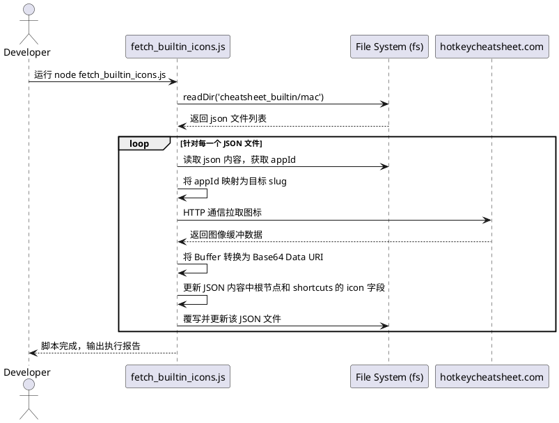

# 规格说明：内置快捷键数据图标下载工具

## 1. 目标
编写一个 Node.js 脚本工具，自动遍历 `src/infrastructure/data/cheatsheet_builtin/mac` 目录（以及后续支持的其他目录）下的所有内置快捷键 JSON 数据文件，并从 `hotkeycheatsheet.com` 网站上抓取对应应用程序的图标（Icon）。下载下来的图标将被保存到本地指定目录（如 `icons/apps/`），并自动更新 JSON 数据文件中的 `icon` 字段为本地相对路径，从而实现类似第三方热键数据独立图标展示的效果。

## 2. 用户流程
此工具为开发和构建时的自动化脚本，并无直接的用户端 UI 交互。其操作流如下：
1. 开发者在终端运行命令启动脚本（例如：`node scripts/fetch_builtin_icons.js`）。
2. 脚本自动启动，打印启动日志并开始遍历内置数据目录。
3. 针对每一个应用 JSON 文件，脚本提取应用的唯一标识（如 `appId`），并映射为网站对应的 `slug`。
4. 脚本访问网站下载应用图标，并将其转换为 Base64 格式（Data URI）。
5. 脚本将图标 Base64 字符串直接保存到 `src/infrastructure/data/cheatsheet_builtin` 相应路径的 JSON 文件中（包含根节点 `icon` 和快捷键项内的 `icon`）。
6. 该过程不再依赖本地 `icons/apps/` 目录的资源引用。

## 3. 详细设计

### 3.1 架构图 (PlantUML)


### 3.2 核心伪代码
```javascript
// 映射字典，兼容插件内的命名和第三方网站的 slug
const SLUG_MAP = {
    'visual-studio-code': 'vscode',
    'google-chrome': 'chrome',
    // 其他映射...
};

async function processDirectory(dirName) {
    const files = fs.readdirSync(dirName);
    for (const file of files) {
        let json = JSON.parse(fs.readFileSync(file, 'utf-8'));
        let appId = json.appId;
        let slug = SLUG_MAP[appId] || appId;
        
        // 核心下载逻辑
        let iconPath = await fetchAndSaveIcon(slug, appId);
        
        if (iconPath) {
            updateJsonFileWithIcon(file, iconPath);
        }
    }
}

async function fetchAndSaveIcon(slug, appId) {
    // 1. 发起 HTTPS Timeout 限时网络请求拉取图标
    // 2. 将 Buffer 存储至本地 icons/apps/ 目录中
    // 3. 判断并设定正确的后缀名称并返回相对路径
}
```

### 3.3 数据存储与 UI 交互
- **数据存储模式**:
    - 数据由 Node 自带 `fs` 模块直接落盘在磁盘结构中。
    - 图标资源通过文件系统保存在 `icons/apps/`，可以被打包进入应用内。
    - JSON 更新：原有的 `src/infrastructure/data/cheatsheet_builtin/*/` 内结构数据全量读取后，仅更新 `icon` 属性引用再回写。
- **交互反馈**: 
    - 此工具为命令行工具，所有的交互通过 `console.log` / `console.warn` 打印日志，展示如下载成功、已包含图标自动跳过或遭遇拉取错误的情况。

## 4. 测试设计
- **文件检查测试**：随机选取数个常见应用（如 `google-chrome` 或 `visual-studio-code`）对应的快捷键文件跑脚本，检查 `icons/apps/` 下是否真实保存下了可以打开的图片文件（验证文件损坏与否）。
- **回写准确性测试**：执行脚本后，打开源目标 `json`，确认原本配置类似于 `"icon": "icons/macos.png"` 被顺利地转换为了 `"icon": "icons/apps/{appId}.png|svg"`。
- **鲁棒性（异常控制）测试**：若拉取过程遭遇超时（模拟断网或访问无数据 API），或者文件内已标明了独有图标路径，应正确处理或跳过而不打断后续文件的遍历流程。

## 5. 任务拆分
- [x] 创建 `scripts/fetch_builtin_icons.js` 脚本入口文件。
- [x] 定义 `SLUG_MAP` 来建立 `appId` 和网站下载来源 `slug` 的准确匹配字典。
- [x] 封装 HTTPS 网络请求及 `downloadWithTimeout` 防死锁机制。
- [x] 根据拿到的数据文件头（Buffer Header）识别并保存对应的（PNG / SVG）文件格式并落盘到 `icons/`。
- [x] 开发针对源 JSON 文件的解析、修正（替换默认图标）与写回模块。
- [x] 进行运行实测，保证内置平台（mac/win）数据可顺利获得各自所需的适配图标。