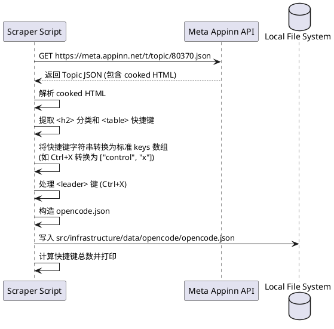

# spec-00014-support-opencode

## 目标
抓取 [OpenCode.ai 快捷键](https://meta.appinn.net/t/topic/80370) 并将其集成到项目中，存放在 `src/infrastructure/data/opencode/` 目录下。抓取完成后需要提供抓取的快捷键总数。

## 用户流程
1. 开发人员运行抓取脚本。
2. 脚本访问小众软件论坛 API 获取快捷键数据。
3. 脚本解析 HTML 内容，提取分类和快捷键信息。
4. 脚本生成 `opencode.json` 文件并保存到指定目录。
5. 脚本在终端打印抓取的快捷键总数。

## 详细设计

### 逻辑逻辑设计
使用 PlantUML 描述抓取与转换流程：

### 核心伪代码
```javascript
// 快捷键解析逻辑
function parseKeys(raw) {
  const leader = ["control", "x"];
  let keys = raw.toLowerCase().replace(/ctrl/g, "control").replace(/alt/g, "option").replace(/shift/g, "shift").replace(/super/g, "command");
  // 处理特殊字符
  keys = keys.replace(/←/g, "left").replace(/→/g, "right").replace(/↑/g, "up").replace(/↓/g, "down");
  
  if (keys.includes("<leader>")) {
    const parts = keys.split(" ").filter(p => p !== "<leader>");
    return [...leader, ...parts];
  }
  return keys.split(/[\s+]+/);
}

// HTML 解析逻辑 (使用 Regex 模拟简单的 HTML 解析)
const categoryRegex = /<h2>.*?<\/a>(.*?)<\/h2>/g;
const tableRegex = /<div class="md-table">.*?<table>(.*?)<\/table>.*?<\/div>/gs;
```

### 数据存储
文件路径: `src/infrastructure/data/opencode/opencode.json`
格式示例:
```json
{
  "appId": "opencode",
  "appName": "OpenCode",
  "updatedAt": 1711684800000,
  "shortcuts": [
    {
      "title": "退出应用",
      "description": "退出应用 (OpenCode)",
      "keys": ["control", "c"],
      "keyword": "opencode 应用级 退出应用",
      "category": "应用级"
    }
  ]
}
```

## 测试设计
- **验证点 1**: 验证生成的 `opencode.json` 是否包含所有 9 个分类（如应用级、侧边栏、消息区导航等）。
- **验证点 2**: 验证 `<leader>` 键是否正确转换为了 `["control", "x"]`。
- **验证点 3**: 验证特殊符号（如 `←`, `→`）是否正确转换为了 `left`, `right`。
- **验证点 4**: 验证总数输出是否正确。

## 任务拆分
- [ ] 创建 `src/infrastructure/data/opencode/` 目录。
- [ ] 编写 `scripts/crawl_opencode_shortcuts.js` 抓取脚本。
- [ ] 实现针对 Discourse HTML 表格的解析逻辑。
- [ ] 实现快捷键键名标准化逻辑。
- [ ] 运行脚本并生成 `opencode.json`。
- [ ] 提交生成的 JSON 文件和脚本。