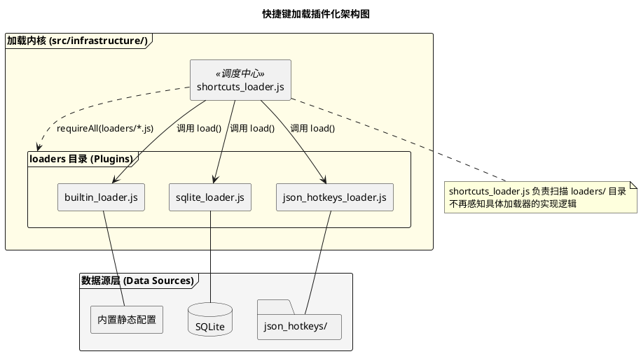
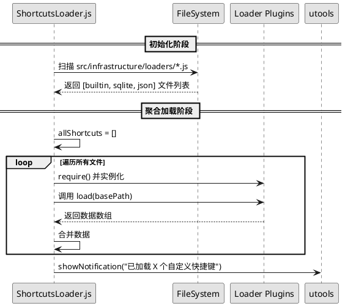
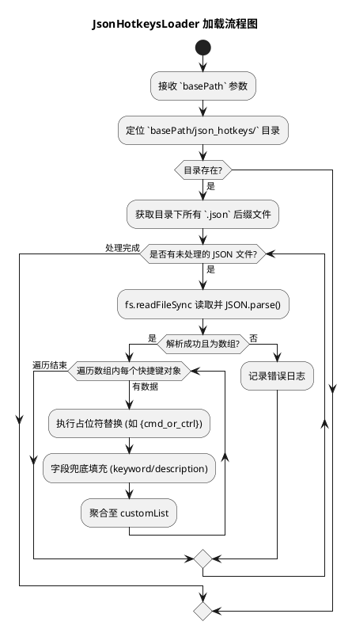
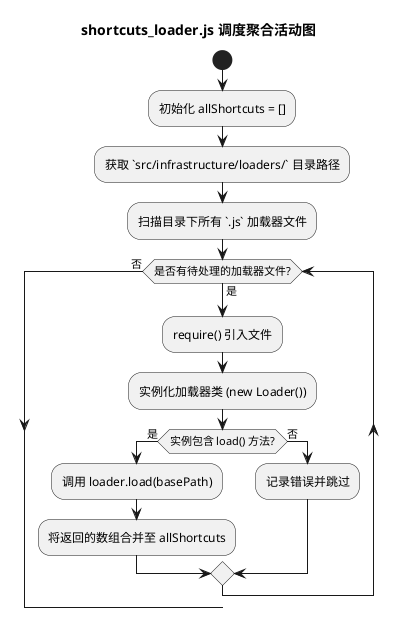

# Spec 0006: 支持用户自定义 JSON 快捷键

## 目标
支持用户通过 JSON 文件自定义快捷键，方便扩展插件尚未覆盖的应用或个人特定操作，并提供灵活的存储路径配置。

## 用户流程
1. **配置存储路径**: 用户通过 `/path` 命令选择一个本地目录。插件会自动在该目录下创建 `json_hotkeys` 文件夹及 `template.json` 示例。
2. **编写自定义配置**: 用户在 `json_hotkeys` 目录下新增或修改 `.json` 文件。
3. **加载与生效**: 插件启动或进入时，自动扫描并加载该目录下所有 JSON 配置。
4. **视觉反馈**: 加载完成后，弹出系统通知提示总共加载了多少个自定义快捷键。

## 详细设计

### 1. 存储设计
- **配置项名称**: `sqlite_db_path` (复用现有配置，作为基础目录)。
- **子目录**: `json_hotkeys/`。
- **模板文件**: `json_hotkeys/template.json`。

### 2. 加载与生效细化方案

#### 2.1 触发机制
- **进入时扫描**: 每当用户唤起插件并进入 `快捷键查找` 功能时，插件会自动检查 `json_hotkeys/` 目录。
- **路径变更触发**: 通过 `/path` 命令成功修改基础路径后，立即强制执行一次目录扫描。
- **延迟加载策略**: 采用异步扫描模式，确保插件界面秒开，不因文件读取而阻塞主线程。

#### 2.2 数据解析与转换逻辑
- **文件检索**: 仅扫描 `basePath/json_hotkeys/` 下的一级 `.json` 文件。
- **原子性替换**: 遍历 `keys` 数组，执行平台兼容性映射：
  - `{cmd_or_ctrl}`: Windows 映射为 `ctrl`，macOS 映射为 `command`。
- **字段填充**: 若 JSON 条目缺失 `description` 或 `keyword`，则使用 `title` 作为备选，确保搜索功能可用。
- **数据注入**: 将解析后的数组追加至内存中的 `allShortcuts` 头部，实现**自定义优先展示**。

#### 2.3 异常处理与健壮性
- **容错解析**: 使用 `JSON.parse` 前后包裹 `try...catch`，单个文件解析失败不影响后续加载。
- **空目录支持**: 若 `json_hotkeys/` 目录为空，自动跳过，不报任何错误。
- **重复过滤**: 插件在加载时会根据 `title + keys` 的组合进行去重，防止同一配置文件被多次加载。

#### 2.4 反馈机制 (优化建议)
- **变动通知**: 为了防止在该功能的“进入即扫描”机制下产生高频通知，插件会维护一个会话级的缓存状态。
  - **首次加载**: 仅在首次检测到包含自定义快捷键时通知。
  - **动态变更**: 仅在扫描到的自定义快捷键总数发生变化时（如用户新增或删除了配置条目），才会再次触发通知提示。
- **文案示例**:
  - *系统初次通知*: `已成功加载 5 个自定义快捷键`。
  - *更新通知*: `用户自定义快捷键已更新 (当前共 6 个)`。

### 3. 逻辑架构 (PlantUML)

#### 3.1 模块依赖与集成关系图 (插件化分层)


#### 3.2 动态插件加载时序图


### 3.3 自定义 JSON 样例配置
为了方便用户编写，插件提供了包含跨平台占位符及自动补全逻辑的 JSON 格式。

```json
[
  {
    "title": "谷歌翻译 (Ctrl+Shift+T)",
    "description": "自定义快捷键示例",
    "keyword": "google translate fanyi",
    "keys": ["{cmd_or_ctrl}", "shift", "t"],
    "icon": "logo.png"
  },
  {
    "title": "打开记事本 (Alt+N)",
    "description": "自定义应用快捷键",
    "keyword": "notepad jishiben",
    "keys": ["{opt_or_alt}", "n"]
  }
]
```

### 4. 核心流程说明 (Activity Diagrams)

#### 4.1 PathCommand 初始化流程图
@startuml
title PathCommand 初始化流程图

start
:用户执行 /path 命令;
:弹出目录选择对话框并获取 `selectedPath`;
:拼接目标子目录 `json_hotkeys/`;

if (目录是否存在?) then (否)
  :创建 `json_hotkeys/` 目录;
endif

:检查 `template.json` 是否存在;
if (模版文件存在?) then (否)
  :写入包含 "{cmd_or_ctrl}" 占位符的默认 JSON 配置;
endif

:在 uTools 存储中保存路径配置;
:提示“配置成功”;
stop
@enduml
```

**逻辑说明**：
- **环境预检查**：插件会自动确保目标路径下存在 `json_hotkeys/` 文件夹。
- **配置先行**：在完成路径配置的同时，自动生成包含标准占位符（如 `{cmd_or_ctrl}`）的示例数据，帮助用户零门槛起步。
- **状态持久化**：将选择的路径实时写入 uTools 的持久化存储，供后续加载模块在每次启动时动态读取。

#### 4.2 JsonHotkeysLoader 执行流程图


**逻辑说明**：
- **高容错扫描**：对目录下的 JSON 文件执行循环遍历，使用了原子化的解析策略，单个文件的结构损坏不会干扰整体加载进度。
- **语义转换**：加载器内部会执行系统级的按键映射（如 macOS 下将 `{cmd_or_ctrl}` 映射为 `command`），并自动为不规范的条目（如缺失描述）进行语义兜底。
- **结果导出**：此模块专注于特定目录的数据转换，不参与上层的全局合并逻辑，保持了单一职责。

#### 4.3 shortcuts_loader.js 调度聚合活动图


**逻辑说明**：
- **基于文件夹的动态注册**：调度器通过文件系统动态扫描 `loaders/` 目录，实现了“约定优于配置”的插件自动发现。
- **基于接口的无感集成**：主逻辑仅通过定义的 `load()` 接口与各个具体实现类通信，彻底解耦了具体数据源（如 SQLite、JSON 或内置静态数据）。
- **同步合并策略**：主调度器逐一获取子加载器的数据并进行合并去重，产出最终驱动搜索界面的 `allShortcuts` 核心数据集。

## 5. 测试设计

| ID | 场景 | 步骤 | 预期结果 |
| :-- | :-- | :-- | :-- |
| T01 | 首次配置路径 | 执行 `/path` 选择目录 | 目录中出现 `json_hotkeys/template.json` |
| T02 | 加载自定义 JSON | 在目录下创建 `test.json`，放入 2 条数据，重启 | 弹出通知 "共加载 2 个用户自定义快捷键" |
| T03 | 占位符转换 | keys 使用 `{cmd_or_ctrl}` | Windows 映射为 `ctrl`，Mac 映射为 `command` |
| T04 | 非法 JSON 处理 | 故意破坏 JSON 格式 | 插件不崩溃，跳过该文件并在控制台报错 |

## 6. 单元测试设计

### 6.1 JsonHotkeysLoader 单元测试
- **扫描逻辑测试**: 
  - 输入：一个包含 `.json`, `.js`, `.txt` 文件的模拟目录。
  - 预期：仅有 `.json` 文件被解析，其余文件被静默忽略。
- **数据转换测试**:
  - 输入：含 `{cmd_or_ctrl}` 和 `{opt_or_alt}` 的 keys 数组。
  - 预期：在模拟的 Windows 环境下得到 `ctrl` / `alt`，Mac 环境下得到 `command` / `option`。
- **容错性测试**:
  - 输入：一个格式损坏的 JSON 文件。
  - 预期：`load()` 方法不抛出异常，返回空数组或其余正常文件的数据。

### 6.2 ShortcutsLoader (聚合器) 单元测试
- **动态插件加载测试**:
  - 模拟：在 `loaders/` 目录下放置两个模拟加载器类。
  - 验证：`loadAll()` 是否正确实例化它们并依次调用 `load()`。
- **接口兼容性测试**:
  - 模拟：一个不包含 `load()` 方法的非法 JS 文件放入 `loaders/`。
  - 验证：聚合过程不中断，且在控制台输出警告信息。
- **结果合并测试**:
  - 模拟：多个加载器返回交叉的数据集。
  - 验证：最终汇总的数组长度及内容是否符合各子集之和。

## 7. 代码重构实施路径

### 7.1 重构步骤

#### 第一阶段：建立插件目录
新建 `src/infrastructure/loaders/` 文件夹。

#### 第二阶段：逻辑剥离与归属
将原 `shortcuts_loader.js` 中的逻辑按职责拆分：
1. **builtin_loader.js**: 
   - 迁移内置 JS 和静态 JSON 加载逻辑。
   - **包含 `updatePlaceHolder()` 等内置数据处理逻辑**（仅在此插件内使用）。
2. **sqlite_loader.js**: 
   - 迁移 SQLite 数据库读取逻辑。

#### 第三阶段：新加载器实现
3. **json_hotkeys_loader.js**: 
   - 实现扫描用户 `json_hotkeys/` 目录的逻辑。

#### 第四阶段：ShortcutsLoader 动态聚合
- 修改 `shortcuts_loader.js`，实现对 `loaders/` 目录的自动遍历和 `load()` 调用。
- 确保对外提供的接口仍然是 `shortcuts_loader.js` 导出，不改变外部调用方的感知。


