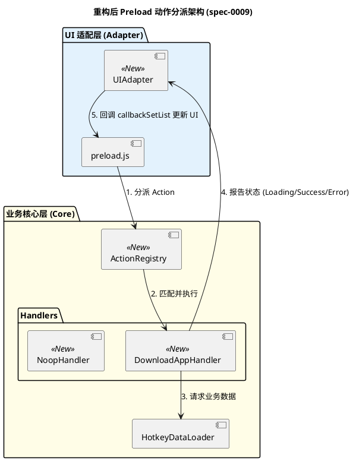

# 软件设计文档：重构 Preload.js 以实现界面与逻辑解耦 (spec-0009)

## 1. 背景与目标 (Context & Goals)

在当前的 `src/adapter/preload.js` 中，`select` 回调函数混杂了大量的具体功能逻辑（特别是 `download_app_hotkeys` 相关的异步处理和列表更新）。

### 1.1 核心痛点
- **职责混杂**：`preload.js` 既负责适配 uTools 接口，又负责通过 `lastCallbackSetList` 构建具体的 UI 元素（标题、图标等）。
- **代码重复**：同样的“正在下载 -> 下载成功/失败”逻辑在 `shortcuts` 和 `app_shortcuts` 两个模式中完全重复。
- **逻辑散乱**：由某个 Command 生成的动作（Action），其处理逻辑却在 Preload 入口处耦合。

### 1.2 重构目标
- **界面与功能解耦**：核心逻辑不再感知如何构建 uTools 的列表项。
- **职责分明**：Preload 仅作为“路由器（Router）”，负责分发请求到对应的处理器（Handler）。
- **规范化反馈**：建立标准化的 UI 反馈接口（UI Bridge），减少重复代码。

### 2.1 架构演进与变化点 (Architecture & Key Changes)



#### 🚀 核心变化点：
1.  **逻辑路由化 (Routing)**：建立 `ActionRegistry`。原本分散在 `preload.js` 多处的判断逻辑被集中管理，`preload.js` 仅负责分派。
2.  **UI 定义抽象 (UI Abstraction)**：引入 `UIAdapter`。业务层不再直接拼装 `[{ title, icon }]` 对象，实现了对 `uTools` 展现形式的解耦。
3.  **职责归位 (Logic Descent)**：复杂的异步下载逻辑从适配层下沉到业务核心层的 `Handler` 中，使主入口文件回归“薄层适配”的本质。

### 2.2 引入 `UIAdapter` (UI 反馈桥接)
创建一个简单的工具，封装 `callbackSetList`：
```javascript
// src/adapter/ui_adapter.js (概念代码)
class UIAdapter {
  constructor(callbackSetList) {
    this.cb = callbackSetList;
  }
  
  showLoading(title, description, icon) {
    this.cb([{ title: '获取数据中...', description, icon: icon || 'icons/loading.gif' }]);
  }
  
  showSuccess(title, description, icon) {
    this.cb([{ title: '完成！', description, icon: icon || 'logo.png', action: 'noop' }]);
  }
  
  showError(errorMsg, icon) {
    this.cb([{ title: '操作失败', description: errorMsg, icon: icon || 'logo.png', action: 'noop' }]);
  }
}
```

### 2.2 动作分派路由 (Action Handler Registry)
在 `preload.js` 中不再写死 `if (action === '...')`，而是统一转发：

```javascript
// src/adapter/preload.js (重构后示意)
select: (action, itemData) => {
  // 1. 优先尝试由 SlashCommandManager 处理（针对 / 系列指令）
  if (itemData.action === 'slash_command') {
    return slashCommandManager.execute(itemData.command, '', lastCallbackSetList);
  }
  
  // 2. 针对普通 Action，分发到 ActionRegistry
  const ui = new UIAdapter(lastCallbackSetList);
  if (actionRegistry.has(itemData.action)) {
     return actionRegistry.get(itemData.action).handle(itemData, ui);
  }
  
  // 3. 回退到默认逻辑
  select(itemData, g_hitTimeStamps);
}
```

### 2.3 核心处理逻辑搬迁
将 `download_app_hotkeys` 的逻辑搬迁到专门的 Handler 中。
Handler 接收 `itemData` 和 `UIAdapter` 实例，调用服务层执行任务，并使用 `UIAdapter` 反馈状态。

## 3. 任务分解 (Tasks)

1.  **基础设施**：
    - 创建 `src/adapter/ui_adapter.js`
    - 创建 `src/core/action_registry.js`
2.  **处理器迁移**：
    - 在 `src/core/action_handlers/` 下创建 `download_app_handler.js`
    - 迁移 Preload.js 中的 Promise 链到 Handler 中。
3.  **适配器修改**：
    - 精简 `src/adapter/preload.js` 中的 `select` 函数。
    - 确保 `shortcuts` 和 `app_shortcuts` 都使用同一套分发逻辑。

## 5. 测试设计 (Testing Design)

### 5.1 单元测试 (Unit Testing)

重构后，由于 UI 逻辑与业务逻辑被抽象化，我们可以针对各个组件编写非侵入性的单元测试。

-   **`UIAdapter` 测试**：
    -   验证 `showLoading` 是否生成了带有 `icons/loading.gif` 的列表项。
    -   验证 `showSuccess` / `showError` 是否正确携带了 `action: 'noop'`，以防点击后进入死循环。
-   **`ActionRegistry` 测试**：
    -   测试重复注册相同 Action 时的覆盖策略。
    -   测试分派不存在的 Action 时的容错处理（不应抛出异常）。
-   **`ActionHandlers` 测试**：
    -   **状态流转验证**：Mock `UIAdapter`，验证 `DownloadHandler` 在异步过程中是否严格遵循 `Loading -> (Success | Error)` 的时序。
    -   **异常捕获验证**：即便 `HotkeyDataLoader` 抛出网络异常，Handler 也应通过 `ui.showError` 友好地展示给用户，而不是在后台静默失败。

### 5.2 模拟集成测试 (Simulation Testing)

在 `test/test_preload_decoupling.js` 中模拟 uTools 环境：
1.  模拟 `lastCallbackSetList` 回调。
2.  构造包含不同 `itemData.action` 的点击包。
3.  验证 `preload.js` 的 `select` 回调是否能根据 `ActionRegistry` 成功分发并触发相应的 UI 更新。

## 6. 收益 (Benefits)
1.  **高内聚低耦合**：Preload 不再关心下载具体是如何实现的。
2.  **易于扩展**：新增 Action 只需在注册表中增加 Handler，无需修改入口文件。
3.  **保持一致性**：所有的操作反馈（Loading/Success/Error）外观统一，易于管理。
4.  **可测试性提升**：不再依赖复杂的宿主仿真，可通过标准 Mock 验证业务流程。
